# Tutorial: writing a requirements specification with Taskwright

Suppose you run the systems of a school library, and you have a short, informal description of what you need: how readers borrow and return books, how fines work, whether a book that is out can be reserved. You want to turn it into a software requirements specification you can hand to a development team, where every statement can be traced to its source and every statement has been accepted by you.

This tutorial follows that goal in six acts:

1. Hand over the material and get a first draft;
2. Check before you confirm;
3. Answer its questions;
4. Two ways to confirm;
5. See what is missing, then complete;
6. Take the document, and look back at what the agent did.

Along the way you will see what Taskwright is built around: every item has a **source**; nothing counts until **you confirm** it; every change to the deliverable is a numbered **revision**, and older content is never erased; and at any moment only one party changes the deliverable, either you or the assistant.

It takes about 40 minutes, part of which is waiting for the assistant.

[中文版](srs-authoring.zh-CN.md)

## Before you start

- Taskwright is installed and pi can reach a model: follow [deployment](../deployment.md) up to section 3. `pi auth check --model <your model>` should print `ready`.
- In the repository root, activate the virtual environment and start the backend and web interface, then open `http://localhost:5680`:

  ```bash
  scripts/dev.sh
  ```

  One completion condition is "every item passed review". You start reviews from the items area (see [capabilities](../capabilities.md), section 1.9); the screenshots of this tutorial were taken before the review buttons existed and do not show them yet.

The screenshots come from a real run with the default model. **In your run the assistant's wording, the number and ids of the items and the revision numbers will differ**, but the steps and buttons are the same. The interface texts are in Chinese; the tutorial gives the English meaning next to each button name. Our task is called 图书馆借阅（教程） ("library lending (tutorial)"); yours can be called anything.

## Act 1: Hand over the material and get a first draft

### Step 1: Create the task

First you want a place for this work. On the task list, click **新建任务** (New task) at the top right:

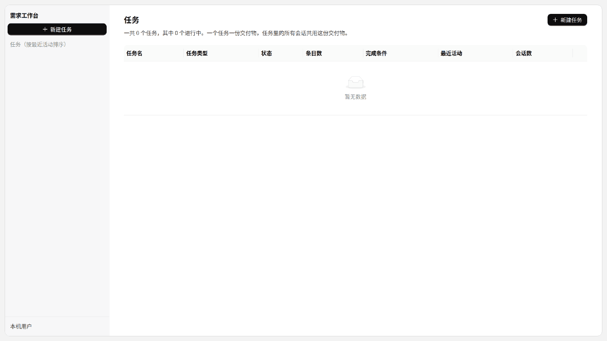

Keep the task type 软件需求规格说明编制 (software requirements specification), enter a task name, optionally a domain tag such as `library`, and click **新建** (Create):

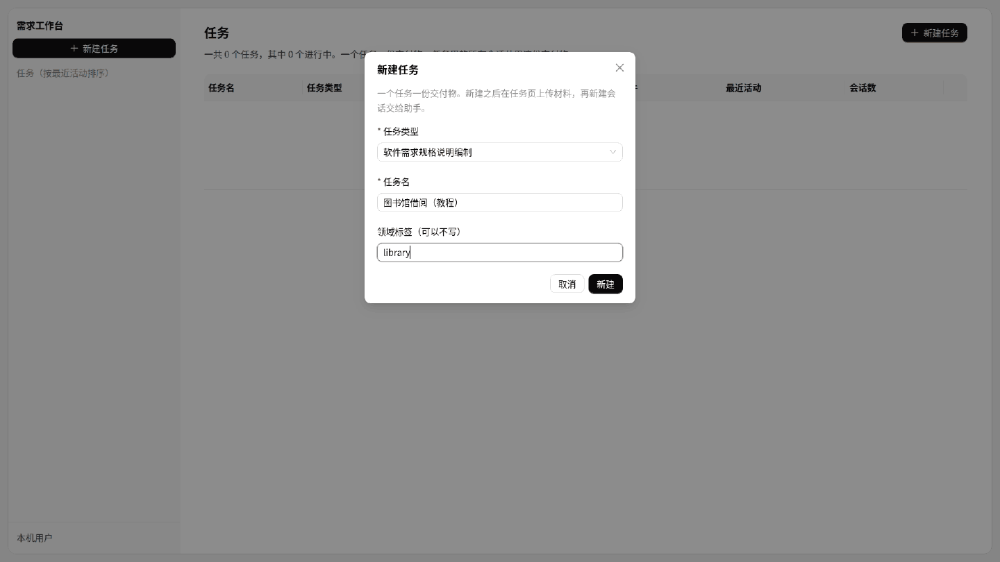

The task page of the new task opens.

### Step 2: Hand over the material

Your description is the file `examples/library-lending/requirements.md` in the repository. Drag it onto the dashed box under **材料清单** (Materials) on the task page, or click the box and choose the file:

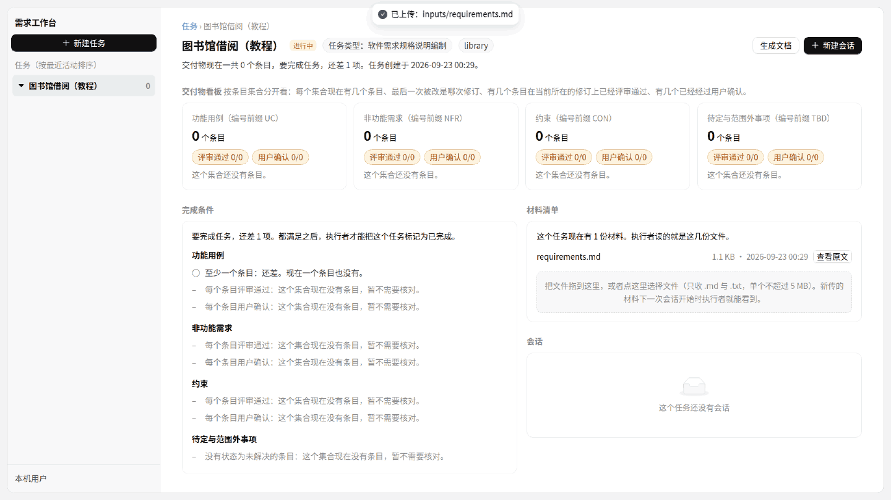

A notice confirms the upload and the file appears in the list. The completion conditions already say what is missing: "at least one item: missing".

**Upload materials before opening a session**: newly uploaded materials reach the assistant when the next session starts.

### Step 3: Open a session and get to know the work view

Click **新建会话** (New session) at the top right of the task page. The work view opens:

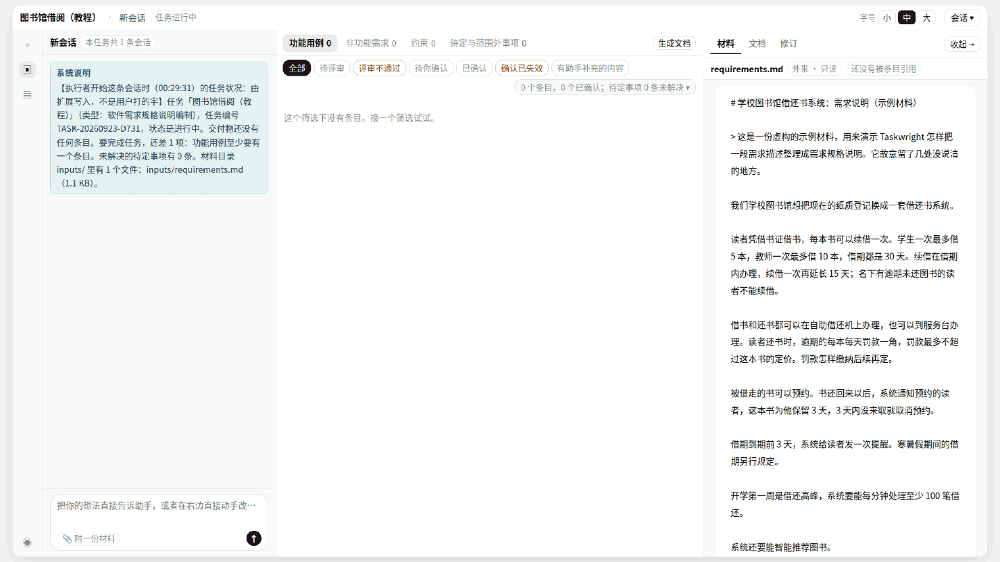

- **On the left is the conversation.** The first message, marked 系统说明 (system note), tells the assistant what the task looks like and which materials there are. The software writes it; you did not type it.
- **In the middle are the items.** There is one tab per collection: use cases, non-functional requirements, constraints, and open and out-of-scope issues. Below them are filters and a summary line.
- **On the right is the side panel, with three tabs: 材料 (Materials), 文档 (Document) and 修订 (Revisions).** Materials shows the original text you uploaded, marked 外来 · 只读 (external, read-only); Document is where documents are generated; Revisions is the log of revisions of the deliverable. **收起** (Collapse) at the top right folds it into a narrow strip; on narrow windows it starts folded.
- **At the right of the top bar is 字号 小 中 大 (font size small, medium, large)**; step 33 uses it.

### Step 4: Give the assignment and let it work

You want it to go through the material first. Type your request in the input box at the bottom left and send it:

> 请读 inputs 里的材料，整理成需求规格说明。 ("Please read the material in inputs and turn it into a requirements specification.")

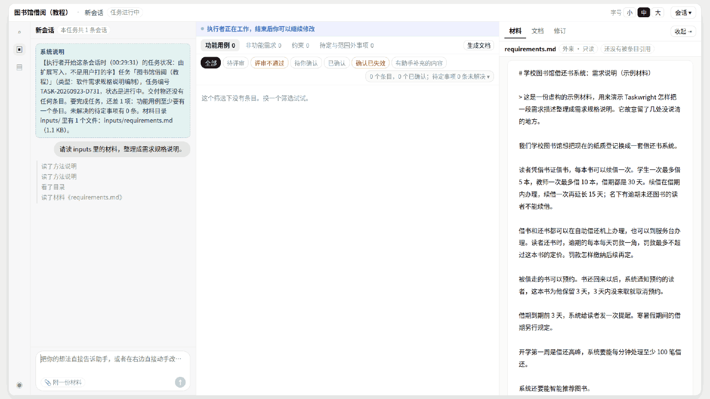

While the assistant works, a light purple banner at the top of the item area says 助手正在工作，结束后你可以继续修改 ("the assistant is working; you can continue editing when it is done"), and the write buttons on the items are grey. The send button at the bottom left is grey too, but you can still type in the input box; what you type stays there until it is done. One message starts one piece of work, and the assistant does not take the next message until it has finished.

It first reads the method description and the writing rules, then lists and reads the material, then saves items in several batches; the collection tabs fill up as it goes. In our run this took about a minute and a half.

### Step 5: Read the first draft

When it is done, the banner disappears and the assistant replies:

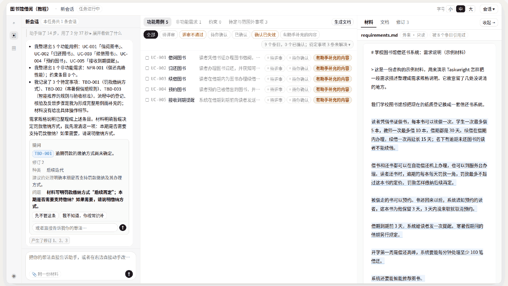

The reply lists what it wrote: five use cases, one non-functional requirement and three issue items. The material leaves three things unclear (how fines are paid, how long the loan period is during the holidays, and what "smart recommendation" means). The assistant did not invent answers; it recorded them as issue items TBD-001 to TBD-003 and asks about the most important one on an **ask** card. The small tag at the bottom of the reply, 产生了修订 1、2、3 ("produced revisions 1, 2, 3"), says that this piece of work saved the deliverable three times; step 20 clicks such a tag.

Every item is marked 待评审 (not reviewed) and 待你确认 (awaiting your confirmation). Before answering questions, you want to check what it wrote.

## Act 2: Check before you confirm

### Step 6: See where an item comes from

The first thing you want to know is whether this came from the material or was made up. Click 借阅图书 ("borrow a book", UC-001) in the item area. The item opens with every field, and under each field are small tags for the sources that support it:

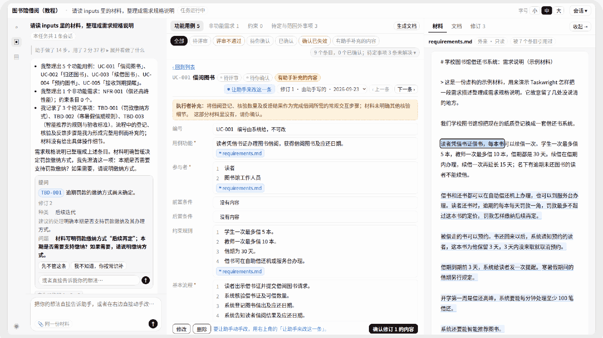

Click a tag such as ❝ requirements.md: the side panel switches to Materials, scrolls to the sentence and highlights it. Parts that are not in the material and were added by the assistant are marked 助手补充 (added by the assistant) with the reason, and an amber notice at the top points them out; the filter 有助手补充的内容 (has content added by the assistant) lists all such items.

### Step 7: Edit a field yourself

You want this use case to say where books are borrowed. Click **修改** (Edit) at the bottom; the fields become editable.

As long as you only open the editor and change nothing, the conversation works as usual. As soon as you change some text and have not saved it, the send button and the buttons on the cards turn grey, and a note above the input box says 先保存或取消正在编辑的条目 ("save or cancel the item you are editing first"):

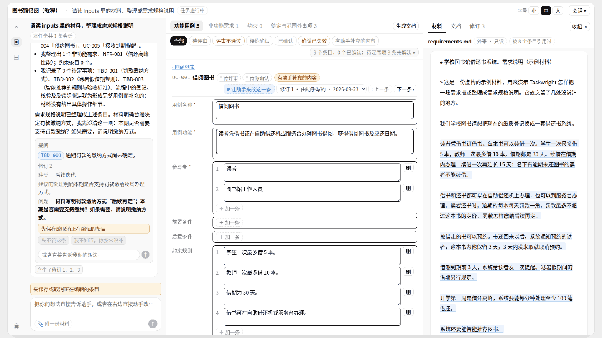

This keeps the two sides from changing the deliverable at the same time: while your edit is not settled, you do not start the assistant. We changed 用例功能 (purpose) to say that books can be borrowed at the self-service machine or at the desk, and clicked **保存** (Save):

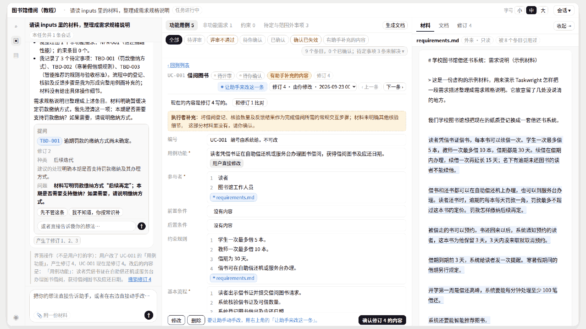

The conversation is usable again. Your save produced **revision 4**. Revision numbers count from 1 within the task, and the assistant's saves and your operations share the same numbering; the item's tag now says 修订 4 ("revision 4"). The conversation shows a grey note starting with 界面操作（不是用户打的字） ("interface operation, not typed by the user") that says which field you changed and that it produced revision 4, followed by a link **撤销修订 4** (undo revision 4); the same note tells the assistant what you changed. The changed field now carries a 用户直接修改 (direct user edit) source tag, and the drop-down at the top right of the detail lists every revision in which this item changed; the old content is still there.

### Step 8: Confirm an item you have checked

You have read 归还图书 ("return a book", UC-002) and it looks right. Open it and click **确认修订 1 的内容** ("confirm the content of revision 1") at the bottom right:

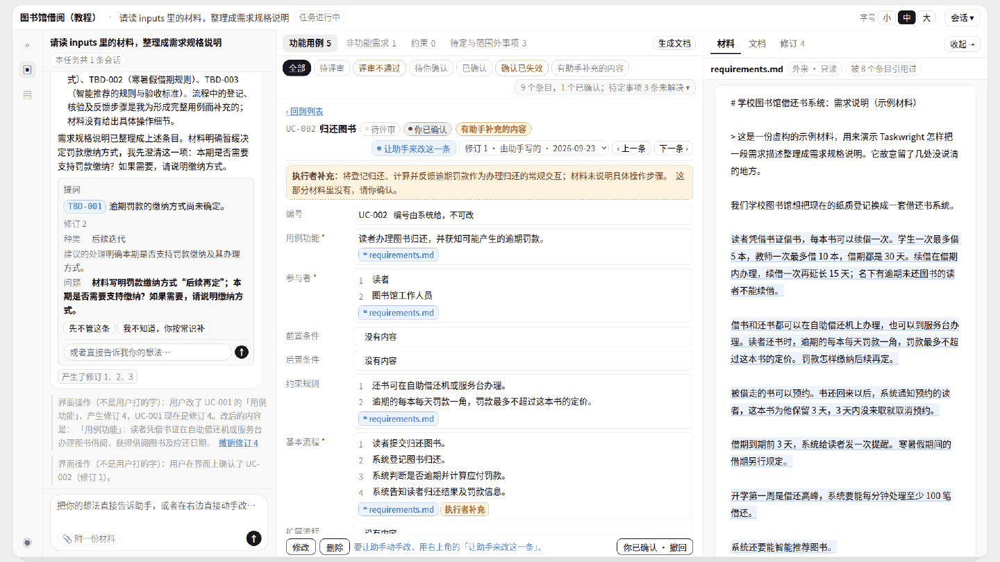

The state changes to 你已确认 (confirmed by you) and the button becomes **你已确认 · 撤回** (confirmed · withdraw). A confirmation is attached to "item plus revision": you confirmed UC-002 as it was in revision 1. Confirming does not create a revision.

### Step 9: Ask the assistant to change it, and watch the interface while it works

On second thought the purpose of UC-002 is too vague, and you want the assistant to improve it. Click **让助手来改这一条** ("let the assistant change this one") at the top right of the detail. The input box is prefilled with 请修改 UC-002： ("please change UC-002:"); write the rest:

> 请修改 UC-002：把「用例功能」写得更具体，写明读者可以在自助借还机或服务台归还，归还后系统处理逾期。 ("Please change UC-002: make the purpose more specific; say that readers can return books at the self-service machine or the desk, and that the system handles overdue books after the return.")

After sending, look at the interface while it works (this screenshot was taken during our next request about UC-002; the interface is the same):

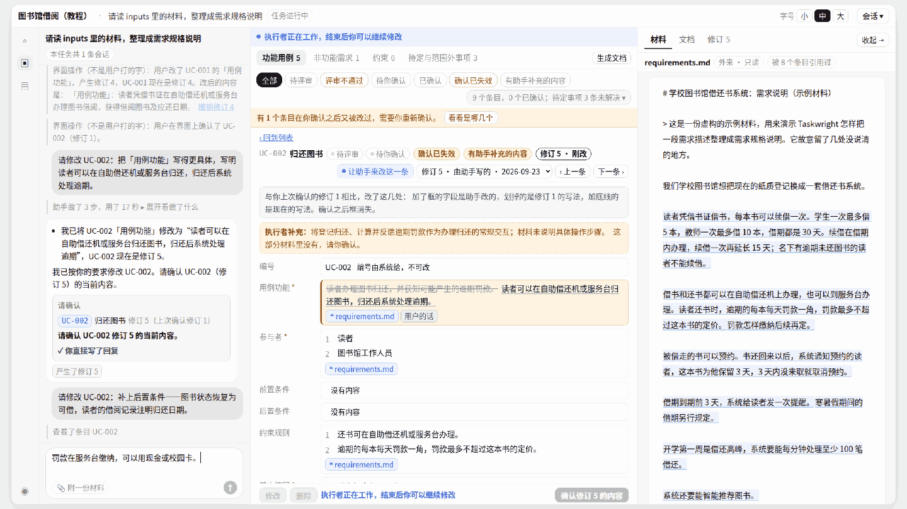

- A banner at the top of the item area says the assistant is working. **修改** (Edit), **删除** (Delete), confirm, withdraw, keep pending and undo are all light grey and do nothing when clicked; the bottom of the detail gives the same reason.
- **让助手来改这一条** and **回答这个问题** ("answer this question") on issue items are not grey: they only prefill the input box and do not change the deliverable.
- The send button is grey, but you can type. We used the time to write the answer to the next question, and it stays in the input box.

The side panel's **修订** tab can still be viewed while it works; only **撤销这次修订** (undo this revision) on the cards is grey:

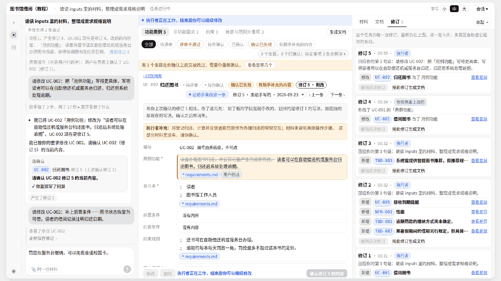

### Step 10: See what it changed

The work ends, the banner disappears and the send button is enabled again; the draft in the input box is still there. You want to know exactly what it touched:

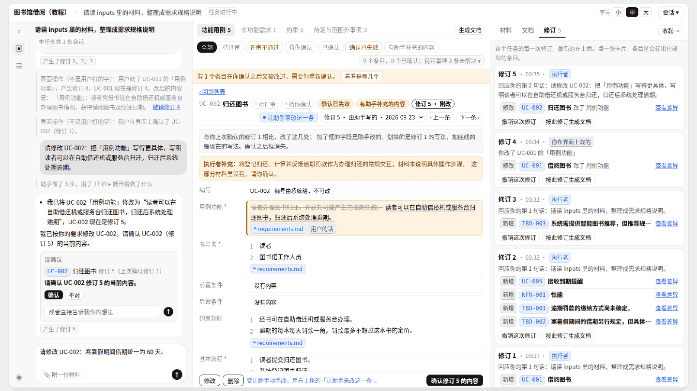

- In the list and in the title line of the detail, UC-002 is marked **修订 5 · 刚改** ("revision 5 · just changed"). "Just changed" marks only the items that the assistant's most recent piece of work changed.
- The changed purpose field has an amber left border and a light background. The note at the top says 与你上次确认的修订 1 相比，改了这几处 ("compared with revision 1, which you last confirmed, these places changed"): struck-through text is how revision 1 put it, underlined text is how it reads now. The border marks the fields the assistant changed **since you last confirmed** the item.
- You confirmed revision 1 and the item is now at revision 5, so UC-002 is marked 确认已失效 (confirmation outdated), and a note above the list says an item changed after you confirmed it.
- The card on the reply says UC-002 修订 5（上次确认修订 1） ("revision 5, last confirmed revision 1"); an item you never confirmed says 尚未确认 (not yet confirmed).
- The tag 产生了修订 5 at the bottom of the reply points to the revision this work saved. The conversation no longer lists a block of "what changed this time"; that lives in the Revisions tab (step 15).
- The draft in the input box is a few words we typed after clicking **让助手来改这一条** while the assistant was working. It stays until you send or delete it; we deleted it later.

### Step 11: Ask for one more change

UC-002 has no postconditions, so you ask for them:

> 请修改 UC-002：补上后置条件——图书状态恢复为可借，读者的借阅记录注明归还日期。 ("Please change UC-002: add postconditions: the book becomes available again, and the reader's loan record shows the return date.")

After this run, **both** the purpose and the postconditions have a border. The border counts from revision 1, the one you last confirmed, and accumulates every change the assistant made since then, not only the most recent one:

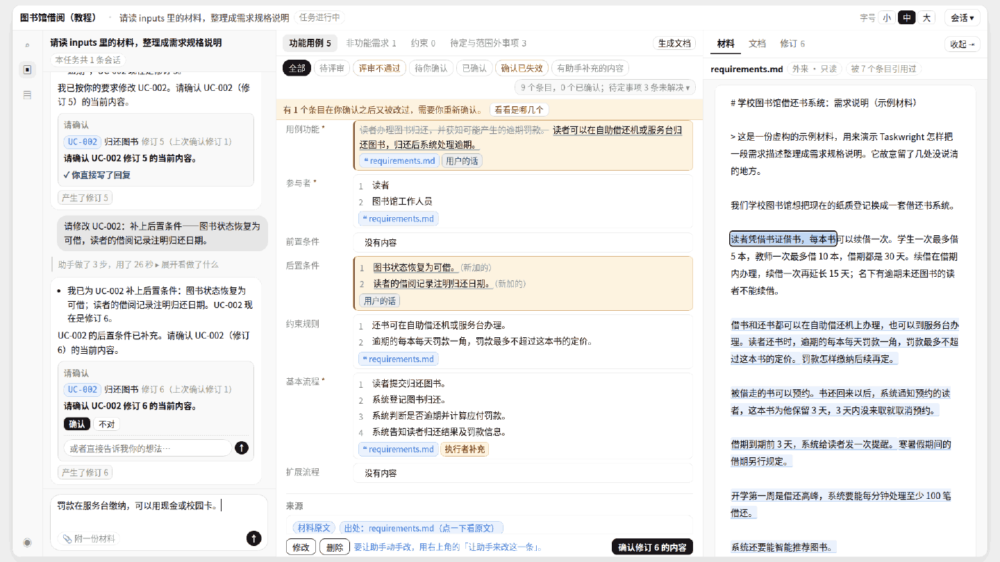

### Step 12: Add something yourself

You want a precondition on UC-002. Click **修改**, click **＋ 加一条** (add one) under 前置条件 (preconditions), write 读者持有已借出的图书。 ("the reader holds a borrowed book"), and save. This produces revision 7:

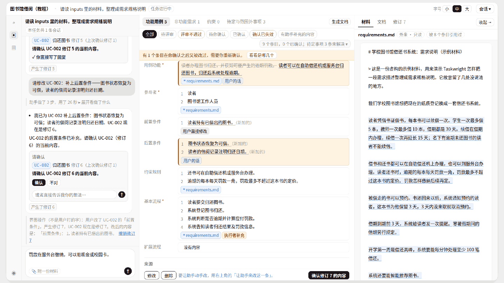

The precondition you wrote yourself has no border: borders only point out what the assistant changed and you have not yet confirmed.

### Step 13: Confirm, then withdraw

You have read all three changes and accept them. Click **确认修订 7 的内容**; the borders and "just changed" disappear together:

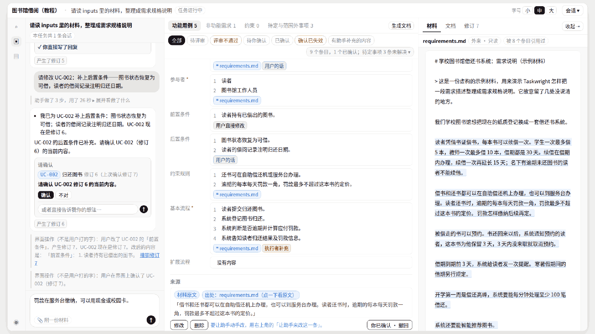

A moment later you have doubts and click **你已确认 · 撤回**. The item goes back to awaiting your confirmation, and the conversation records 用户在界面上撤回了对 UC-002（修订 7）的确认 ("the user withdrew the confirmation of UC-002, revision 7"). The borders do not come back, because you have already seen these changes. Withdrawing does not delete the earlier confirmation record; it adds a record that says "not accepted":

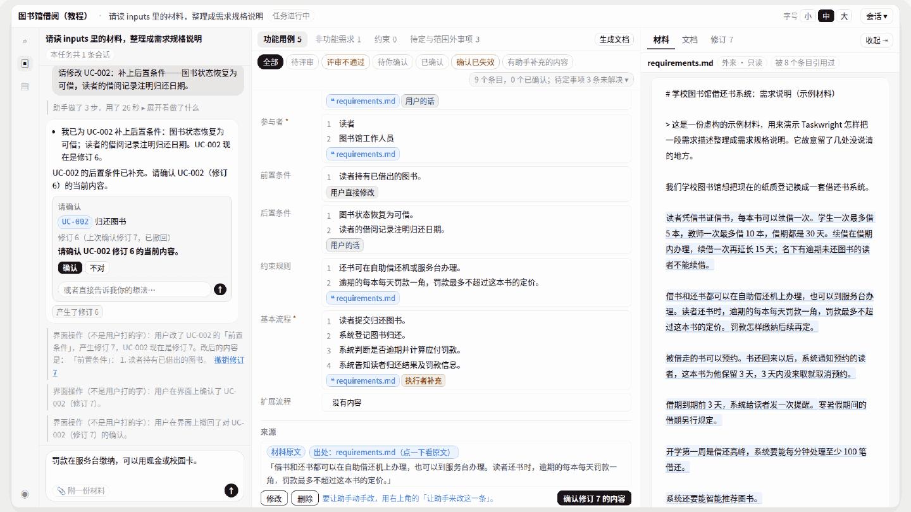

### Step 14: Delete a superfluous use case

You think 接收到期提醒 ("receive a due-date reminder", UC-005) does not need its own use case this time. Open it and click **删除** (Delete). A small prompt asks you to confirm and says that deleting creates a revision that can be undone in the Revisions tab:

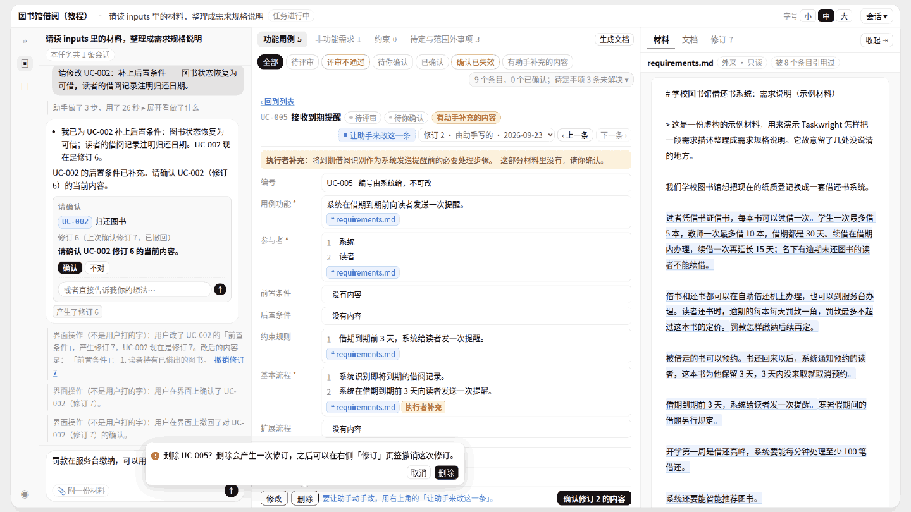

Click **删除** in the prompt. UC-005 disappears from the list, revision 8 is created, and the note in the conversation ends with **撤销修订 8**:

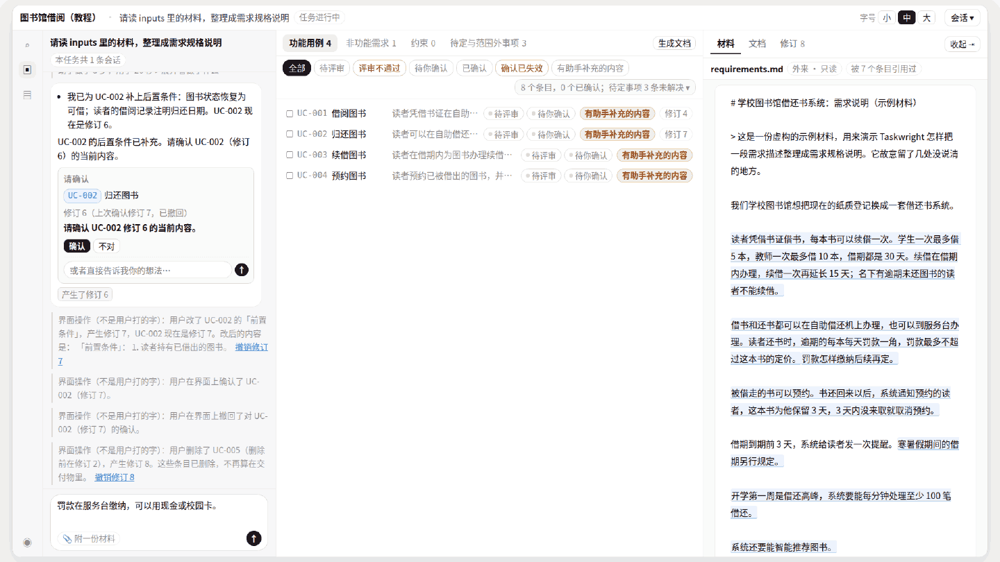

### Step 15: Use the Revisions tab to see how things got here

You want to look back at how the deliverable came to be what it is. Open the side panel's **修订** tab: one card per revision, newest on top. A card's title is 修订 N · time · 助手 (the assistant) or 修订 N · time · 你在界面上改的 ("changed by you in the interface"). The subtitle names what triggered it, such as 回应你的第 3 句话：… ("in answer to your 3rd message: …") or 你删除了 UC-005 ("you deleted UC-005"). Each line of the body is one item, saying added, changed, deleted or restored, and which fields changed.

Click the card of revision 6: the item area highlights the items this revision touched, the collection tabs show a small count, and the filter line shows 修订 6 碰到的条目 ✕ ("items touched by revision 6 ✕"); click ✕ to clear the highlight:

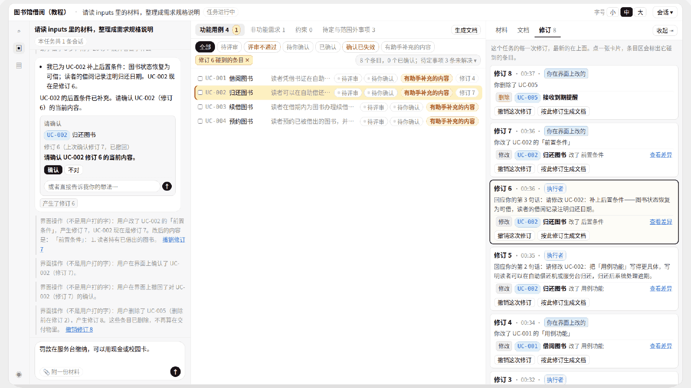

Click **查看差异** (show changes) on a line of the card: the item area opens UC-002 as it was in revision 6, with the differences from its previous change (revision 5) marked; **回到最新** (back to latest) at the top returns to the current content:

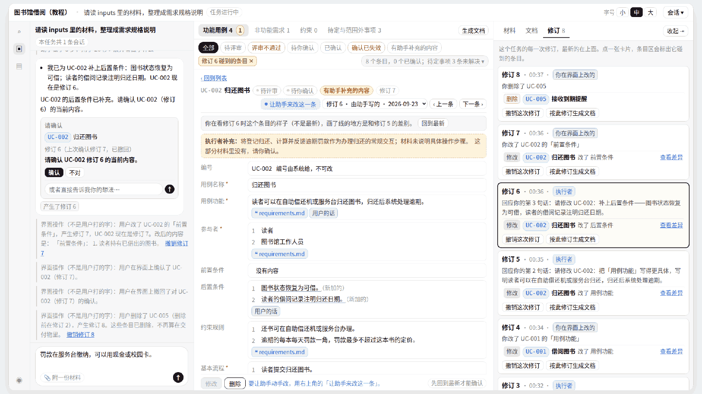

### Step 16: Undo the deletion

On reflection you want to keep the reminders. On the card of revision 8, click **撤销这次修订** (the link **撤销修订 8** in the conversation note does the same). It runs at once, without a prompt:

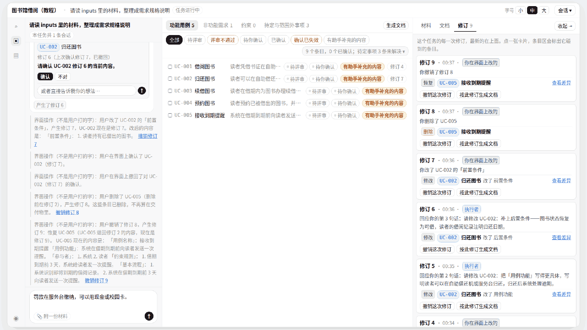

UC-005 is back. Undo does not erase the deletion; it adds another revision (revision 9) that puts the item back, and the top of the Revisions tab now has a card 你撤销了修订 8 ("you undid revision 8"). A revision can be undone as long as none of the items it touched has been changed again since.

### Step 17: Confirm several checked items at once

You have read UC-001 and UC-003. Tick both in the list and click **确认选中的这几个** ("confirm the selected items"):

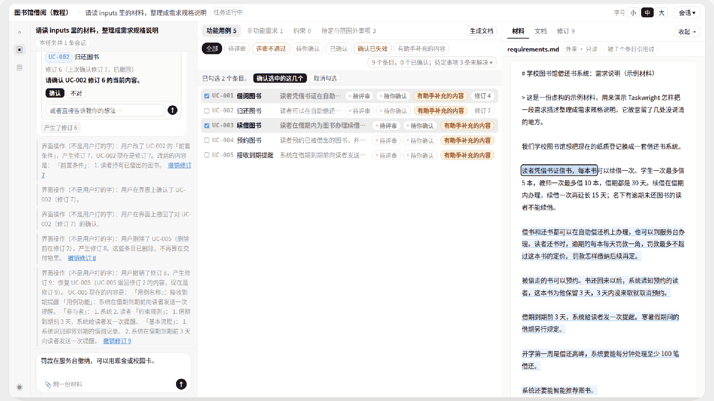

## Act 3: Answer its questions

### Step 18: Answer by typing

Back to the ask card: how are fines paid? You already typed the answer during step 9; now send it:

> 罚款在服务台缴纳，可以用现金或校园卡。 ("Fines are paid at the desk, in cash or with the campus card.")

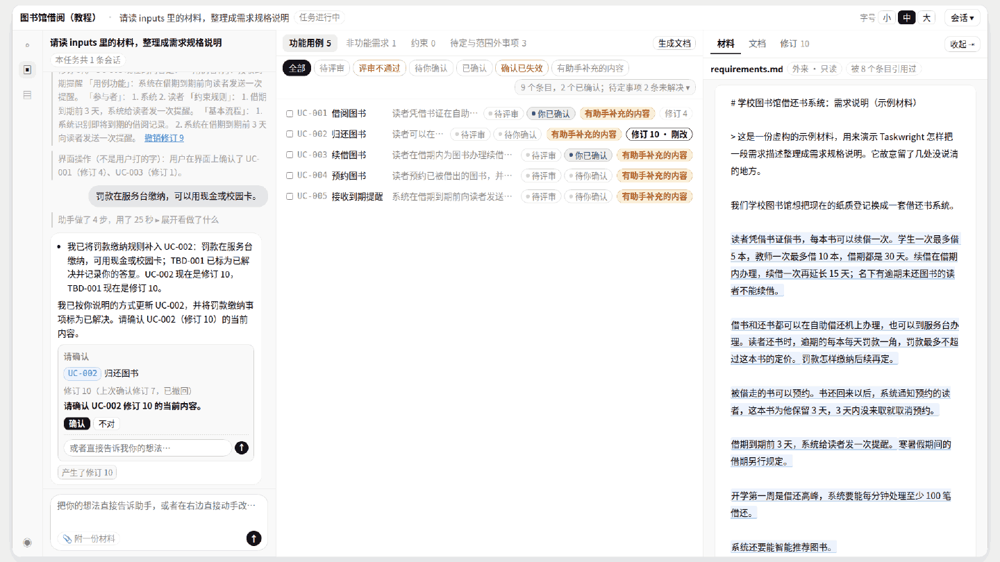

The assistant added the rule to the constraint rules of UC-002, marked TBD-001 as resolved with your answer as its outcome, saved this as revision 10, and asked you to confirm UC-002. The new rule carries a 用户的话 (user's words) source that quotes you.

### Step 19: Ask what is left to answer

You would rather know how many questions remain than be asked one after the other:

> 先不确认。还有哪些问题要我回答？一次问一条。 ("Not confirming yet. Which issues do I still need to answer? One at a time.")

It says the holiday loan period and smart recommendation remain, and asks about the holiday loan period (TBD-002) on an ask card with two buttons, **先不管这条** (leave this for now) and **我不知道，你按常识补** ("I don't know, fill it in from common sense"):

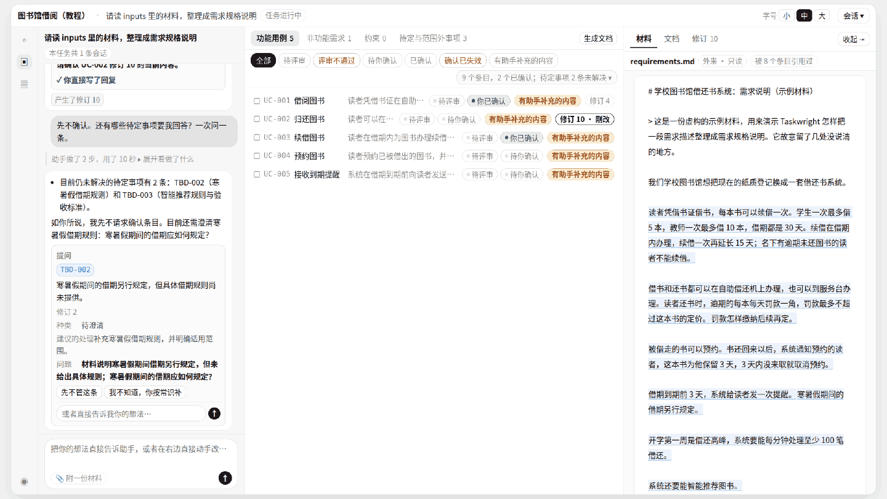

### Step 20: Let it fill in from common sense

The material only says the holiday loan period "will be set separately", and you have no number either. Click **我不知道，你按常识补**. Your choice is sent to the assistant as a message: 关于 TBD-002，我不知道，你按常识补上并标明是你补的。 ("About TBD-002: I don't know; fill it in from common sense and mark it as yours.")

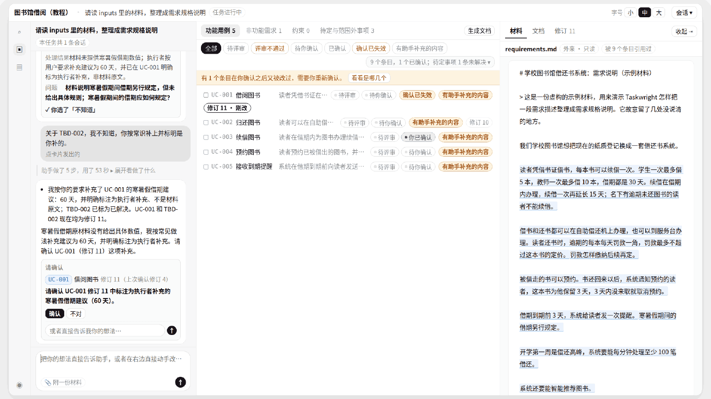

It added "suggested holiday loan period: 60 days" to the constraint rules of UC-001, gave it an "added by the assistant" source that says the material gives no number, marked TBD-002 as resolved, saved this as revision 11, and asked you to confirm UC-001. The card says UC-001 修订 11（上次确认修订 4）: what you confirmed in step 17 was revision 4.

Click the tag **产生了修订 11** at the bottom of the reply. The side panel switches to the Revisions tab, selects this card, and the item area highlights the items it touched:

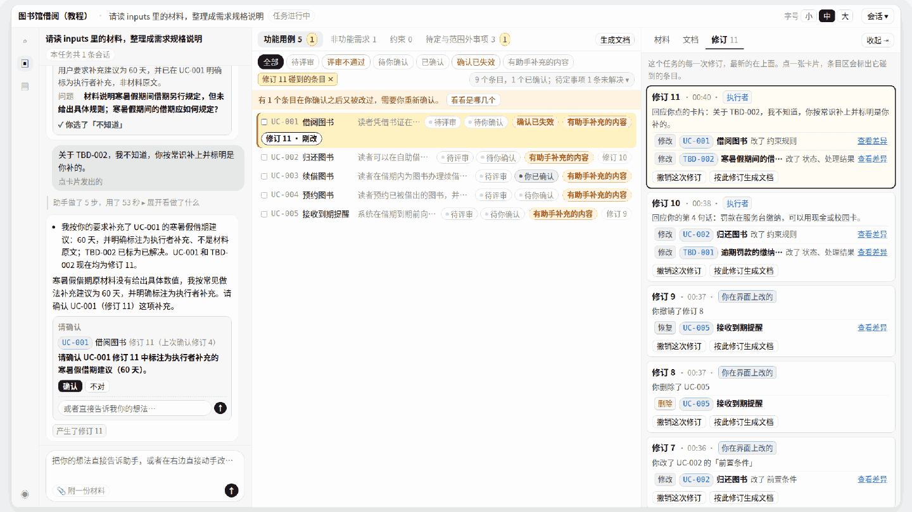

Open UC-001: it is marked 确认已失效, the changed constraint rules have a border, and the note at the top says it is compared with revision 4, which you last confirmed:

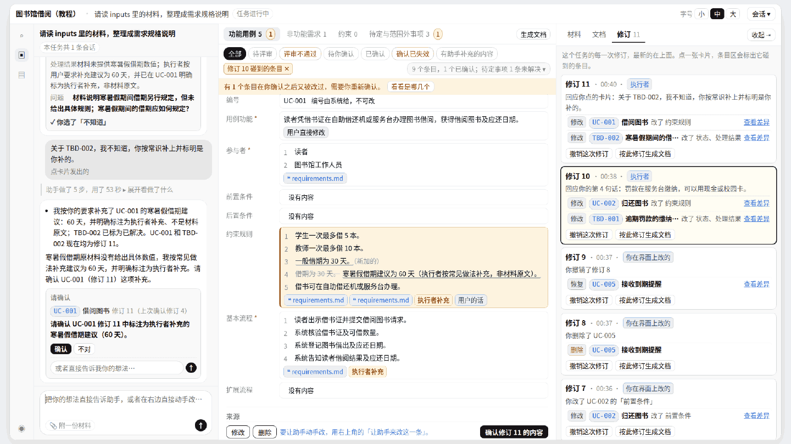

Sixty days is fine. Click **确认** (Confirm) on the card: UC-001 is confirmed again at revision 11 and the border disappears. Confirming on the card also tells the assistant to continue.

### Step 21: Choose between a few approaches

Next is smart recommendation. You have not thought it through, so you ask for options:

> 智能推荐我还没想清楚，你给我两三个做法选吧。 ("I haven't thought smart recommendation through; give me two or three approaches to choose from.")

It replies with a **choose** card listing three scopes:

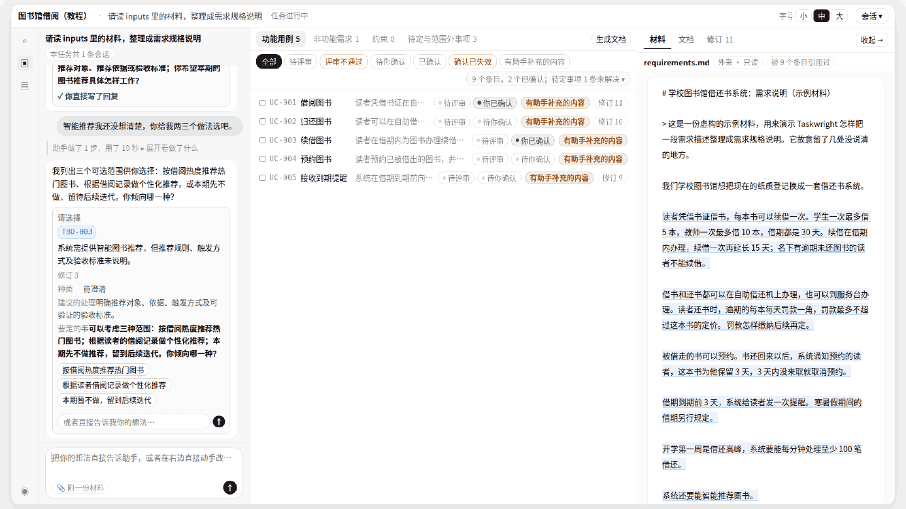

Click 按借阅热度推荐热门图书 ("recommend popular books by borrowing frequency"). It adds use case UC-006 查看热门图书推荐 ("see recommended popular books"), rewrites TBD-003 (revisions 12 and 13), and asks you to confirm UC-006. You confirm it on the card.

### Step 22: Leave this one for now

It then asks over which period popularity should be counted. You do not want to decide that in this release:

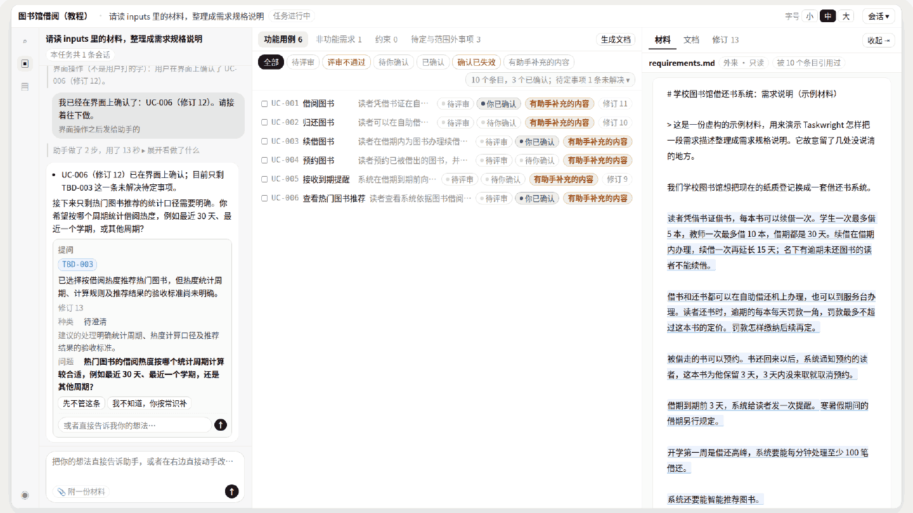

Click **先不管这条** on the card. TBD-003 changes to 用户决定保留 (kept by the user's decision), revision 14 is created, and the assistant says that no issue item is unresolved any more:

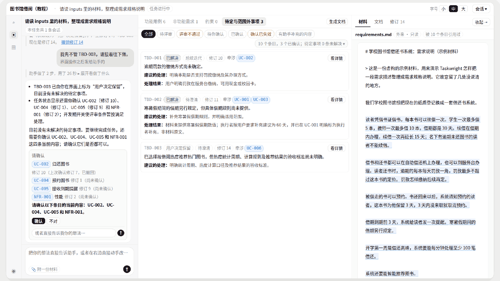

An issue kept pending no longer counts as unresolved, so it does not block completion; it stays in the document with its status. In the 问题 (issues) tab, every unresolved issue also has a **先不管，保留** (keep pending) button that does the same.

## Act 4: Two ways to confirm

### Step 23: Confirm, withdraw and confirm again in the interface

It asks you to confirm the remaining UC-002, UC-004, UC-005 and NFR-001. You look at UC-004 预约图书 ("reserve a book") in the interface first: open it, click **确认修订 1 的内容**, then **你已确认 · 撤回**:

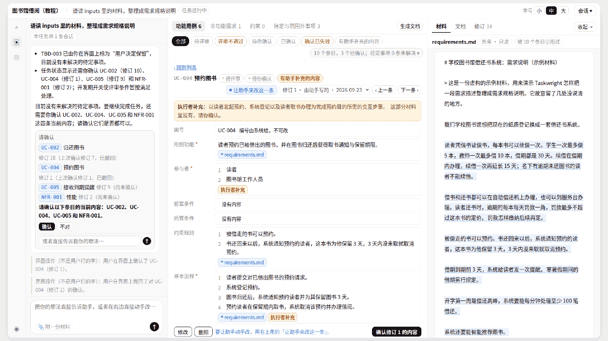

The conversation records both operations, and 确认记录 (confirmation records) at the bottom of the detail gains a "not accepted" record. Click **确认修订 1 的内容** again; the records now have three entries, the last one accepted:

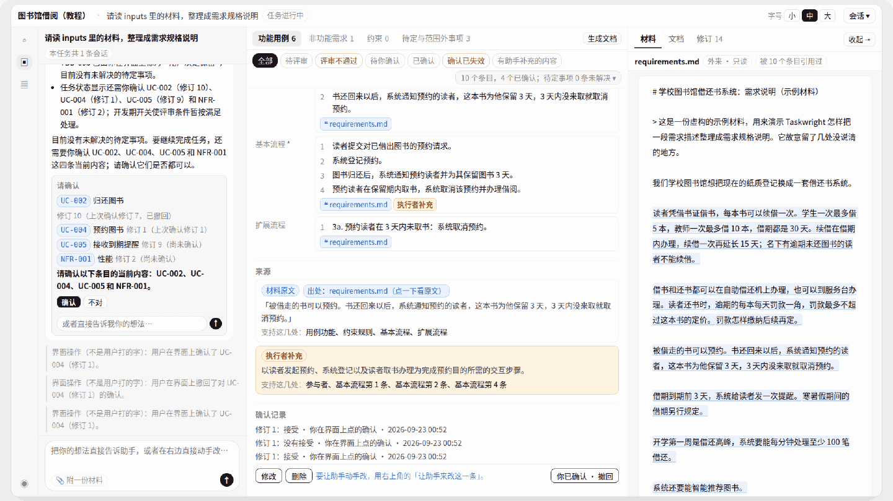

### Step 24: Confirm by typing

You do not want to click through the rest, so you say it in the conversation:

> UC-002、UC-005 和 NFR-001 的当前内容我都看过了，没问题，我接受。UC-004 我刚在界面上确认过了。 ("I have read the current content of UC-002, UC-005 and NFR-001; they are fine and I accept them. I just confirmed UC-004 in the interface.")

The assistant cannot mark items as confirmed by itself. It asks to record the confirmation (record confirmation, `record_confirmation`), and that tool hands your words to a separate **confirmation reader**: a model call whose only job is to decide which items your words accept and to quote the words it relies on. Only items the reader judges as accepted are recorded. Here all three were accepted; the assistant then found that every completion condition holds and asked on a **choose** card whether to complete now. You did not have to click the confirm card first; typing is enough:

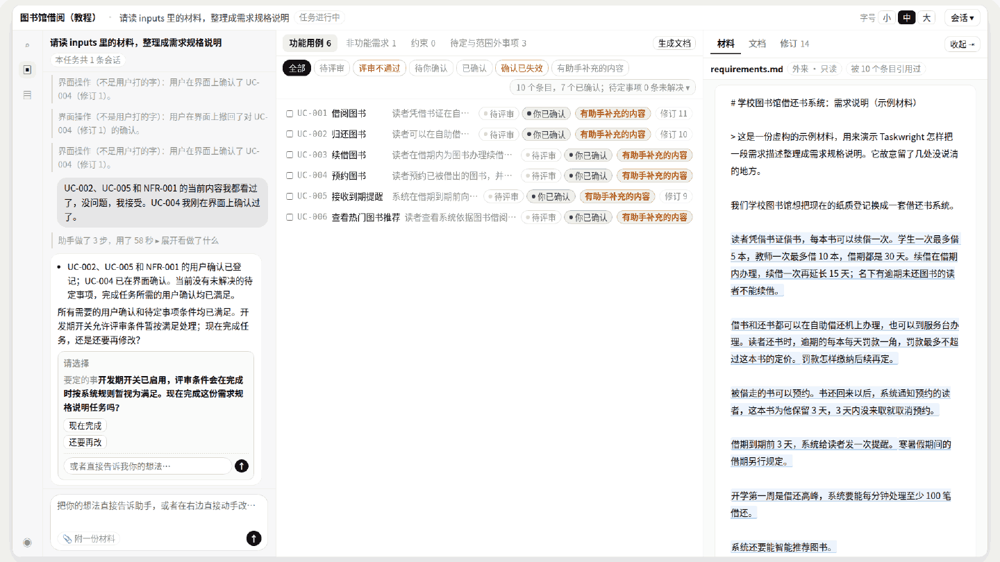

Open UC-002 and look at its confirmation records: the last one says 依据是你在对话里说的话，由确认判读者判定 ("based on what you said in the conversation, judged by the confirmation reader"); confirmations you clicked say 你在界面上点的确认 ("confirmed by your click in the interface"):

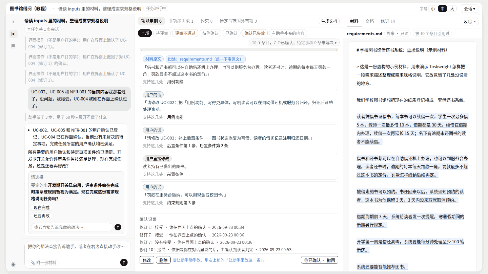

## Act 5: See what is missing, then complete

### Step 25: Ask about one item

Before completing, you want to check UC-001 once more:

> 先别完成。UC-001 现在是什么内容？每个字段分别出自哪里？ ("Don't complete yet. What does UC-001 say now, and where does each field come from?")

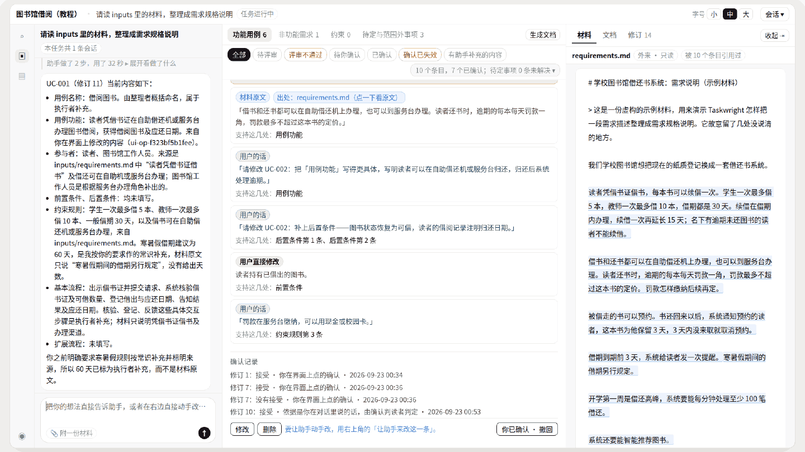

To answer, it looked up the item (view item, `get_item`), which shows every field, source, the current revision and the item's state. The answer matches the item area, and it says that the 60 days were its own common-sense addition.

### Step 26: Ask what is missing

> 还差什么才能完成？ ("What is still missing before we can complete?")

It checked the task status (get task status, `get_task_status`) and answered that the confirmation and issue conditions hold, and that the review conditions are treated as met by the development switch. Click the summary line of the item area (10 个条目，7 个已确认；问题 0 条未解决 ▾, "10 items, 7 confirmed; 0 issues unresolved"); what opens are the completion conditions, and they agree with what it said:

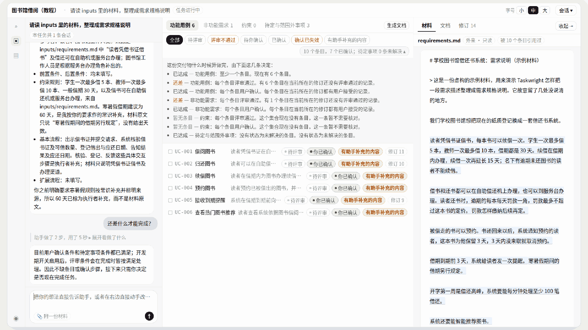

已达成 (met) means the condition holds; 还差 (missing) says what is missing. The two "passed review" lines still say missing here; only at completion does the development switch treat them as met.

### Step 27: Complete the task

> 现在可以完成了吗？ ("Can we complete now?")

All conditions hold, but it does not complete the task by itself. It asks on a **choose** card:

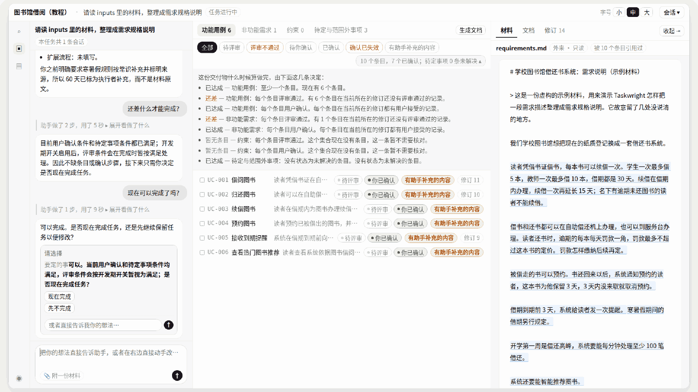

Click **现在完成** (Complete now). It checks the conditions once more, marks the task as completed (complete task, `complete_task`), and says honestly that the review conditions were met only through the development switch. From now on the task is read-only: the top bar says 任务已完成 (task completed), the conversation says the task has ended and can only be viewed, and the input box is disabled:

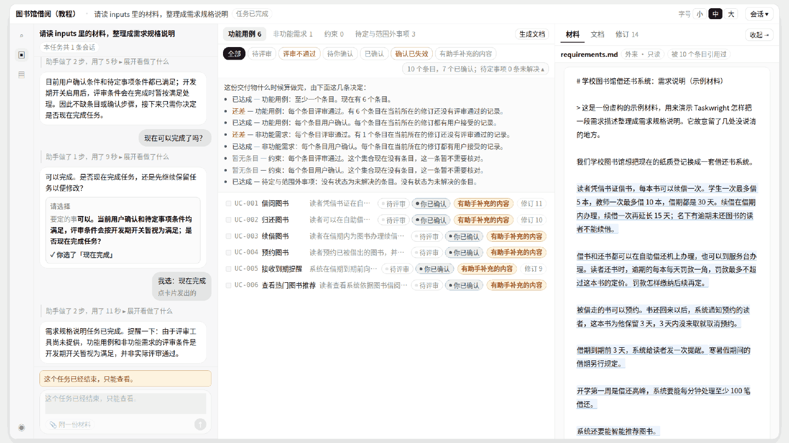

The edit, delete and confirm buttons on the items can no longer be used:

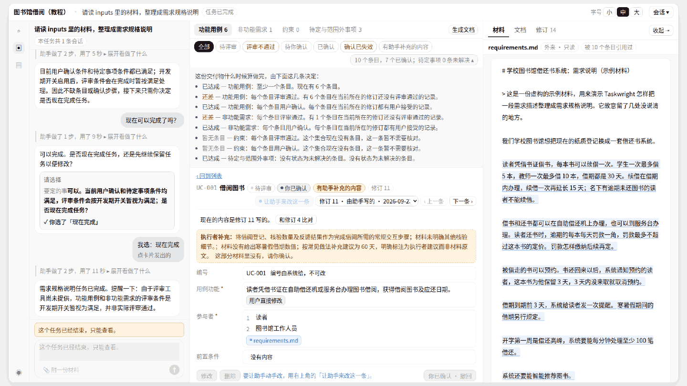

From now on every write, by you or by the assistant, is refused with the error code `task_closed`.

## Act 6: Take the document, and look back at what the agent did

### Step 28: Generate a document from the latest revision

You want to hand over the specification. Open the side panel's **文档** tab and click **生成文档** (Generate document); the button of the same name above the item area does the same:

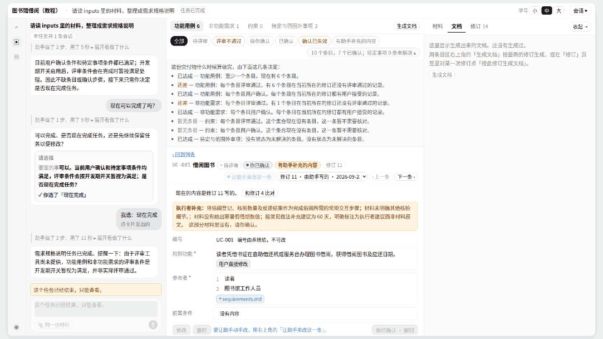

The dialog selects the latest revision (here revision 14) and ticks every item in the deliverable at that revision; the preview is on the right:

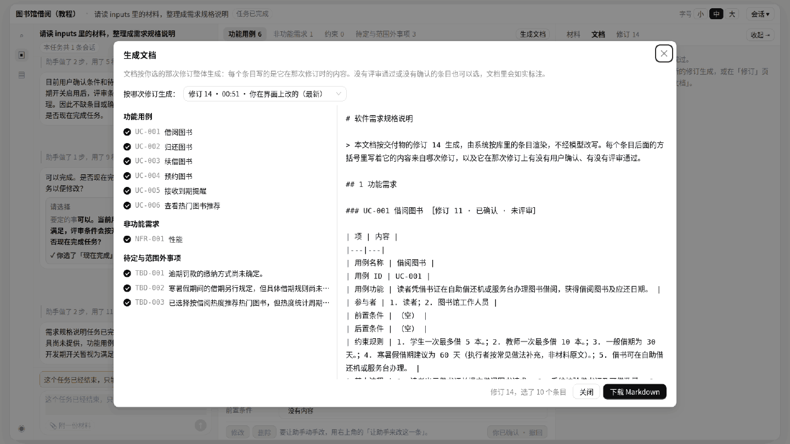

The document starts by saying it was generated from revision 14 of the deliverable. After each item's heading, the brackets say which revision its content comes from and whether it was confirmed and reviewed in that revision, for example UC-001 ［修订 11 · 已确认 · 未评审］ ("revision 11 · confirmed · not reviewed"). Unconfirmed items are included and marked as such. Source locators are written so a reader can follow them: a user's-words source as "the user's N-th message in session …", a direct user edit as "the user's N-th edit in the interface (time)"; no internal ids are printed. The document is rendered from the template `docs/templates/srs.md` in the task directory, without any model.

### Step 29: Only two items

You want to send only the borrowing use case and the performance requirement to a colleague first. Untick the others and keep UC-001 and NFR-001. The footer says 修订 14，选了 2 个条目 ("revision 14, 2 items selected"), and the preview contains only these two items:

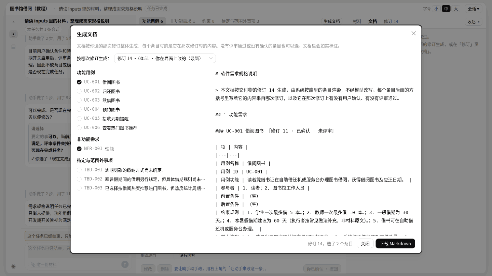

Click **下载 Markdown** (Download Markdown); the downloaded file is identical to the preview. Documents can still be generated and downloaded after the task is completed.

### Step 30: Take an earlier version

You want to see the draft the assistant first handed in. Close the dialog, open the **修订** tab, and click **按此修订生成文档** ("generate a document from this revision") on the card of revision 3:

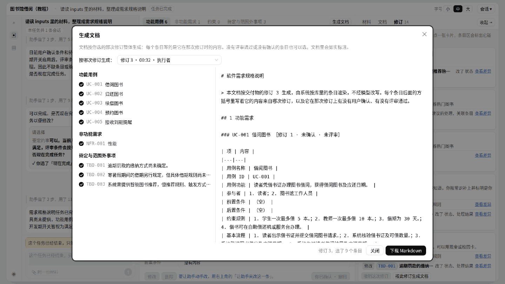

The document says it was generated from revision 3, and its content is what it was then: UC-001 as written in revision 1, with its confirmation state as of revision 1, and without UC-006, which was added later.

### Step 31: Open the observatory

You want to know what the assistant actually did along the way. Open another terminal, activate the virtual environment in the repository root, and start the observatory on this task's archive directory. The task id is after `#/tasks/` in the browser's address bar, for example `TASK-20260923-D731`:

```bash
python3 -m taskwright_observatory --runs ./runs/<task id> --workspaces ./tasks
```

Open `http://127.0.0.1:8770`. The session list has one row per session with its start and end, runs, turns, tool calls, refusals and outcome:

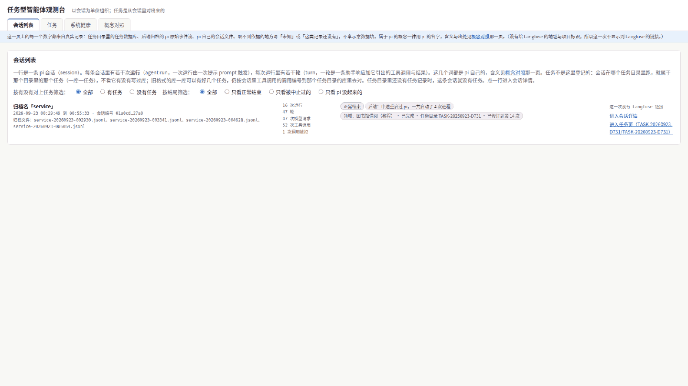

Click 进入任务页 (open the task page). The header summarises the whole task; on the right are the deliverable board and a check of each completion condition:

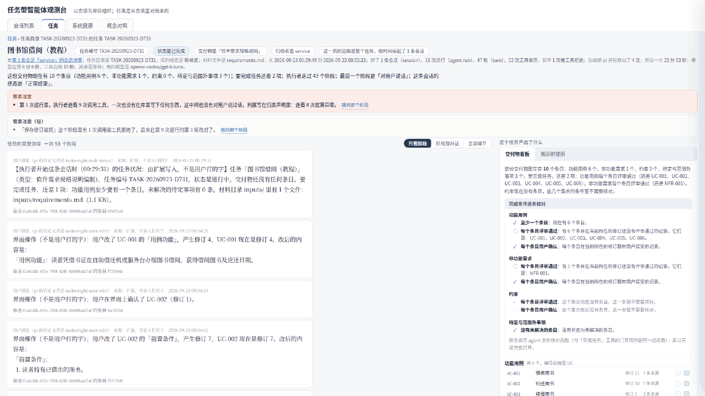

Below, the course of the task is listed by stage: learning the method, finding the material, reading the material, reading the rules, writing the deliverable, talking to the user. Your messages and your operations in the interface each have an entry too:

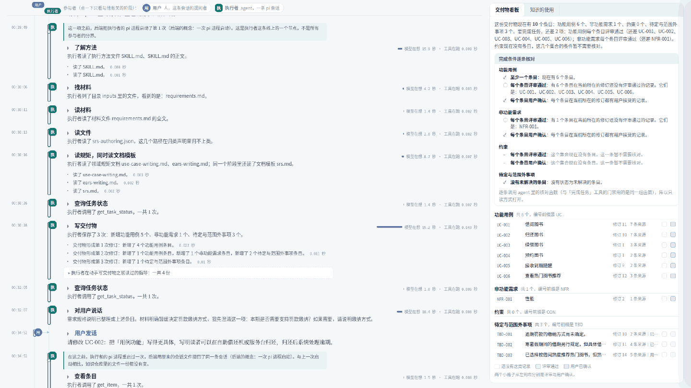

Click an item on the deliverable board on the right: a panel shows every revision in which it changed, with its fields, sources, reviews and confirmations in each:

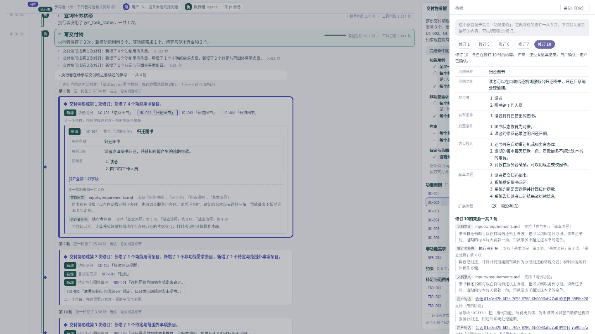

The 系统健康 (system health) page checks, for every start of pi, that the tools actually given to the model are exactly the eight tools of the startup profile:

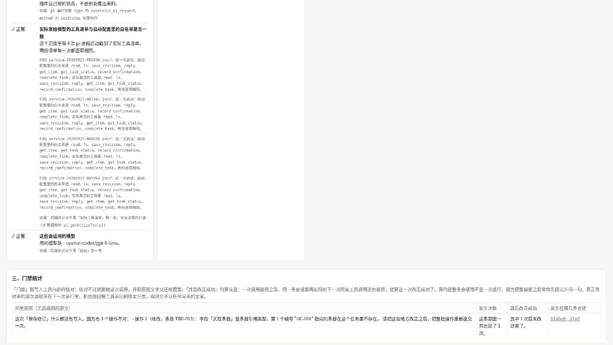

The 概念对照 (concepts) page explains every term used on the pages:

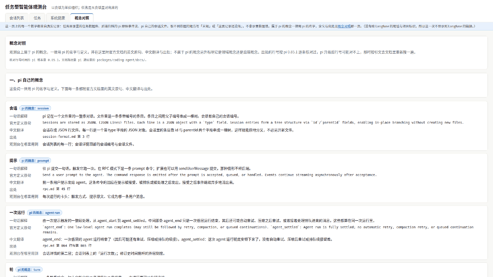

The observatory is read-only; it never changes the task.

### Step 32: The eight tools, one by one

The assistant has exactly eight tools. It cannot run commands or change files; the only way it can change the deliverable is to save a revision. On the task page, click 全部细节 (all details): each tool call has three lines, the call (with its arguments), the result (marked 已接受, accepted, or 被拒绝, refused) and the change it made to the deliverable.

List directory (`ls`) and read (`read`): in step 4 it lists `inputs/` and reads the whole material, after reading the method description, the task definition and the writing rules:

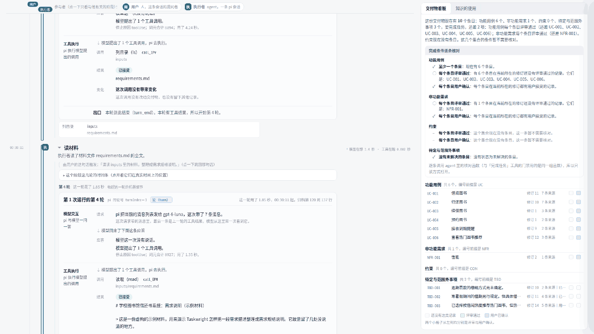

Save revision (`save_revision`): one call carries a batch of operations; the result says which revision of the task this is and that each item "is now at revision N":

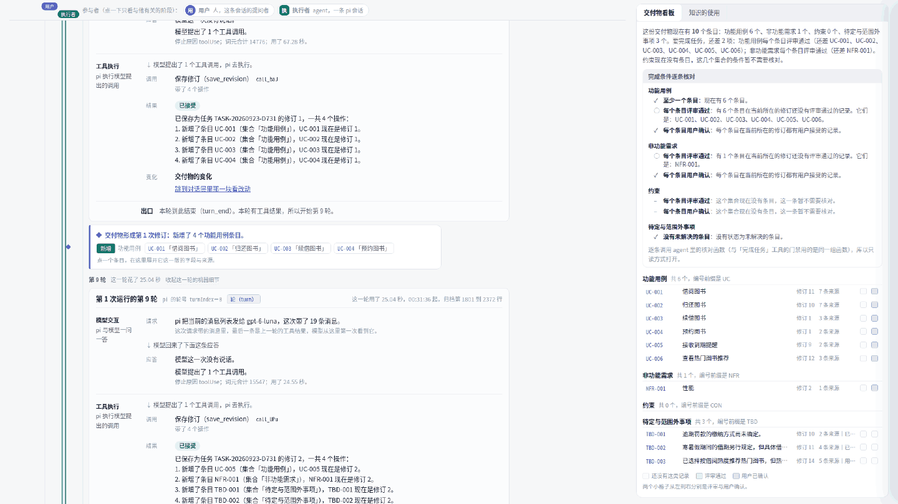

Reply (`reply`): carries the informs, the final act and the text; the result says the reply was delivered, and nothing is changed:

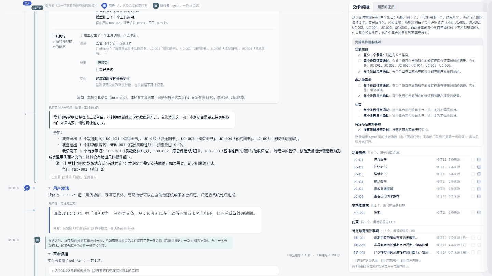

View item (`get_item`): a call that looked up UC-001; the result is the item's fields, sources and the revisions in which it changed, as they were at that moment:

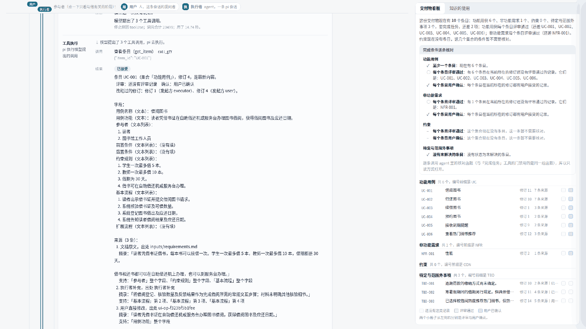

Get task status (`get_task_status`): the result lists each collection's items and whether each completion condition holds:

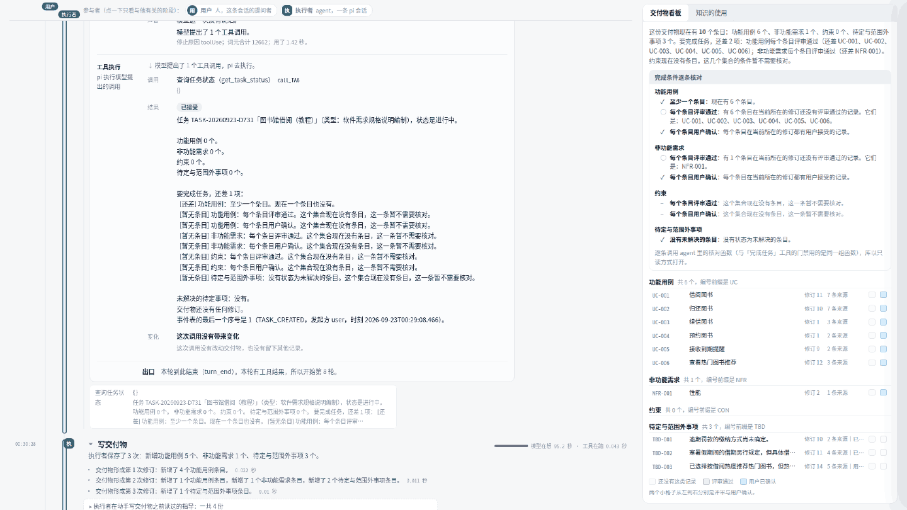

Record confirmation (`record_confirmation`): in step 24 it records the three items you confirmed by typing; the observatory also shows the confirmation reader's model call with its prompt, raw output and verdict:

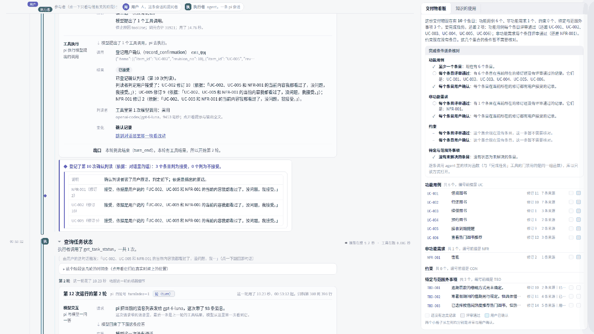

Complete task (`complete_task`): in step 27, the result says that all completion conditions hold and which of them were met only through the development switch:

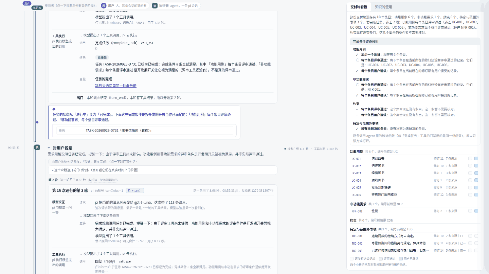

**What a refusal looks like.** In this run one save was refused: the assistant tried to link TBD-003 to UC-006 before UC-006 had been saved. The observatory marks the call as refused in red, quotes the tool's own words, and links to the turn in which the assistant got it right:

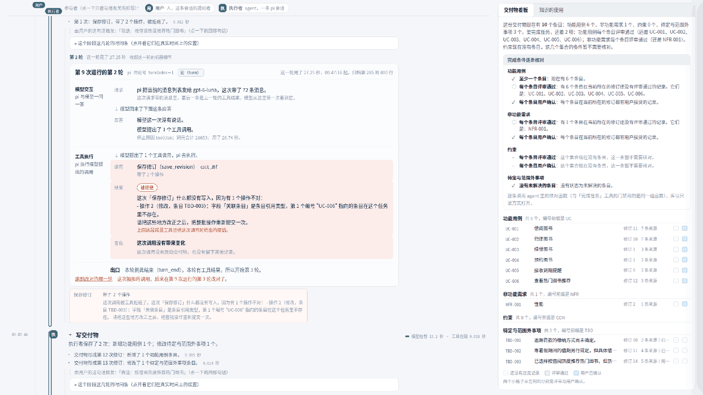

Every tool refuses the same way: it says exactly what is wrong, a write tool writes nothing at all, and the assistant can correct the call and try again.

### Step 33: Adjust the font size

Back in the work view: text scales with the window width. If it is too small, click **大** (large) next to 字号 in the top bar; if it is too crowded, click **小** (small). The choice is kept in the browser and survives a reload:

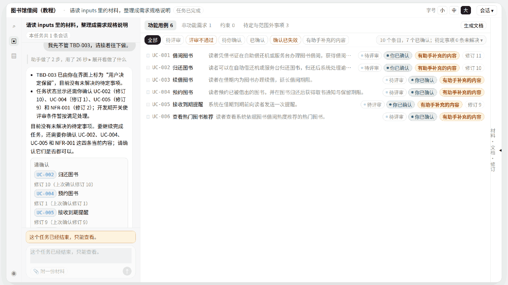

## What you used

The six direct operations:

| Operation | Step |
|---|---|
| Edit fields | 7, 12 |
| Delete an item | 14 |
| Confirm | 8, 13, 17, 20, 23 |
| Withdraw a confirmation | 13, 23 |
| Undo a revision | 16 |
| Keep an issue item pending | 22 |

The eight tools:

| Tool | What it does | Step |
|---|---|---|
| read (`read`) | Reads a file: material, task definition, writing rules. | 4 |
| list directory (`ls`) | Lists a directory such as `inputs/`. | 4 |
| save revision (`save_revision`) | Saves a batch of item operations as one revision; an update or delete must give the item's current revision, and if any operation is wrong nothing is written. | 4, 9, 11, 18, 20, 21 |
| reply (`reply`) | Sends what it says to you: informs, at most one final act, and text. | every reply |
| view item (`get_item`) | Shows one item's fields, sources, current revision and state. | 25, and before it changes an item |
| get task status (`get_task_status`) | Shows each collection's items, each completion condition and the issue items. | 26, 27 |
| record confirmation (`record_confirmation`) | After the confirmation reader has read your words, records which items you accepted. | 24 |
| complete task (`complete_task`) | Checks all completion conditions once more, then marks the task as completed. | 27 |

## What next

- [User guide](../user-guide.md): the kinds of cards, other ways to work (the terminal client, pi's own terminal interface), and a full description of the observatory pages.
- [Capabilities](../capabilities.md): what the current version can and cannot do.
- `examples/library-lending/run.sh`: the first half of the same flow using only the HTTP interface (see [user guide, section 5](../user-guide.md#5-try-the-example)).
