> 本文是英文版 [srs-authoring.md](srs-authoring.md) 的中文译本。本篇已按「看过就算确认」重写，英文版尚未同步，两者不一致时以本篇为准。

# 教程：用 Taskwright 编制一份需求规格说明

假设你是一所学校图书馆的系统负责人，手上有一段随手写的需求：读者怎样借书还书、罚款怎样算、书被借走了能不能预约。你想把它整理成一份能交给开发团队的软件需求规格说明，而且每一条都说得出出处、都经过你看过。

这篇教程跟着这个目标走一遍，分六幕：

1. 交出材料，拿到初稿；
2. 看一看，改一改；
3. 回答它的问题；
4. 看过就算确认；
5. 看还差什么，然后完成；
6. 拿走文档，回头看它做了什么。

一路上你会看到 Taskwright 围绕的几件事：每个条目都有**出处**；你**打开看过**一个条目，就算确认了它，看过一次就一直是已读，之后被改动的地方另有标记；交付物的每次改动都是一次有编号的**修订**，旧的内容不会被抹掉；任一时刻只有一方在改交付物，要么是你，要么是助手。

全程大约 40 分钟，其中一部分时间在等助手。

[English](srs-authoring.md)

## 开始之前

- Taskwright 已经装好，pi 能连上模型：按[部署](../deployment.zh-CN.md)做到第 3 节。`pi auth check --model <你的模型>` 应当打印 `ready`。
- 在代码仓根目录激活虚拟环境，启动后端与网页界面，然后打开 `http://localhost:5680`：

  ```bash
  scripts/dev.sh
  ```

  完成条件里有一条「每个条目评审通过」。评审由你在条目区发起（见[功能说明](../capabilities.zh-CN.md)第 1.9 节）；本教程的截图是评审按钮做出来之前截的，图上还没有这几个按钮。

截图来自用默认模型真实跑的一遍。**你那一遍里助手的措辞、条目的数量和编号、修订号都会不一样**，但步骤和按钮是一样的。我们的任务名叫「图书馆借阅（教程）」，你的任务叫什么都可以。

## 第一幕：交出材料，拿到初稿

### 第 1 步：建任务

你想先有个地方放这件事。在任务列表页点左上角的**新建任务**：

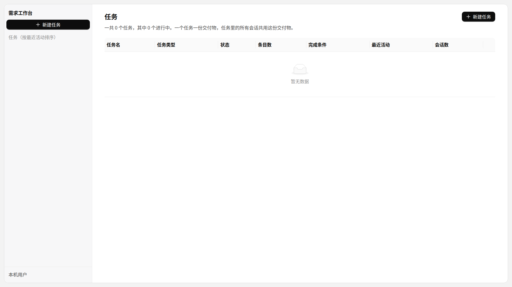

任务类型保留「软件需求规格说明编制」，填一个任务名，可以再填一个领域标签（例如 `library`），点**新建**：

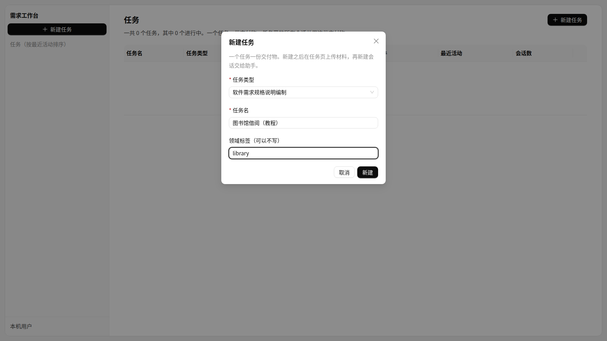

新建之后打开的是这个任务的任务页。

### 第 2 步：交出材料

你手上的需求就是代码仓里的 `examples/library-lending/requirements.md`。把它拖到任务页**材料清单**下面的虚线框里，或者点虚线框选择这个文件：

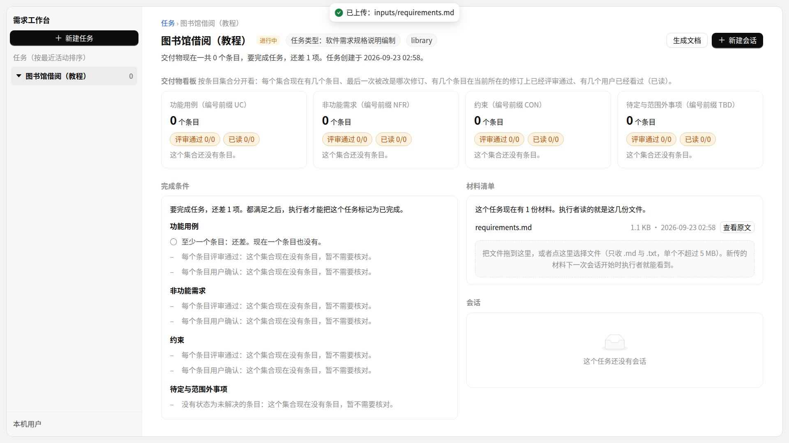

页面顶上提示已上传，文件列进了材料清单。交付物看板上每个集合都写着「评审通过 0/0」「已读 0/0」；完成条件已经写明还差什么：「至少一个条目：还差」。

**先传材料，再开会话**：新传的材料要到下一次会话开始时助手才看得到。

### 第 3 步：开会话，认一认工作视图

点任务页右上角的**新建会话**，进入工作视图：

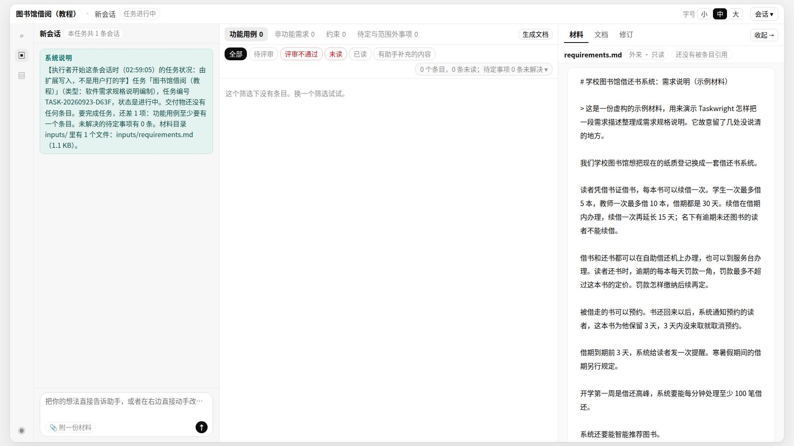

- **左边是对话区。** 顶上一条标着「系统说明」的消息告诉助手这个任务现在的样子和有哪些材料，它由软件写入，不是你打的字。
- **中间是条目区。** 每个集合一个页签：功能用例、非功能需求、约束、问题。下面一行是筛选（全部、待评审、评审不通过、**未读**、**已读**、有助手补充的内容）和一行汇总。
- **右边是右侧栏，有三个页签：材料、文档、修订。** 「材料」显示你上传的原文，标着「外来 · 只读」；「文档」用来生成文档；「修订」是交付物的修订日志。右上角的**收起**把它收成一条竖边，窗口窄时它默认就是收起的。
- **顶栏右边有「字号 小 中 大」**，第 32 步再用它。

### 第 4 步：交代任务，等它干活

你想让它先把材料整理一遍。在左下角的输入框里写下你的要求并发送：

> 请读 inputs 里的材料，整理成需求规格说明。

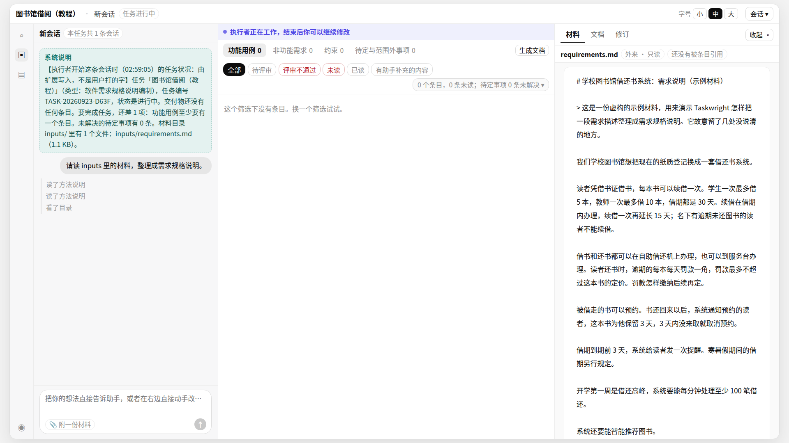

助手工作期间，条目区顶部是一条淡紫色的横幅「助手正在工作，结束后你可以继续修改」，条目上的写入按钮都是灰的，鼠标停在灰掉的按钮上会说明原因；左下角的发送键也是灰的，输入框照样能打字，打好的话留到它做完再发。一句话启动它的一次工作，它做完之前不接下一句。

它会先读方法说明与写作规矩，再列出并读取材料，然后分几批保存条目；条目区的页签会随之陆续填满。我们这一遍用了大约一分半钟。

### 第 5 步：读初稿

做完之后横幅消失，助手回复：

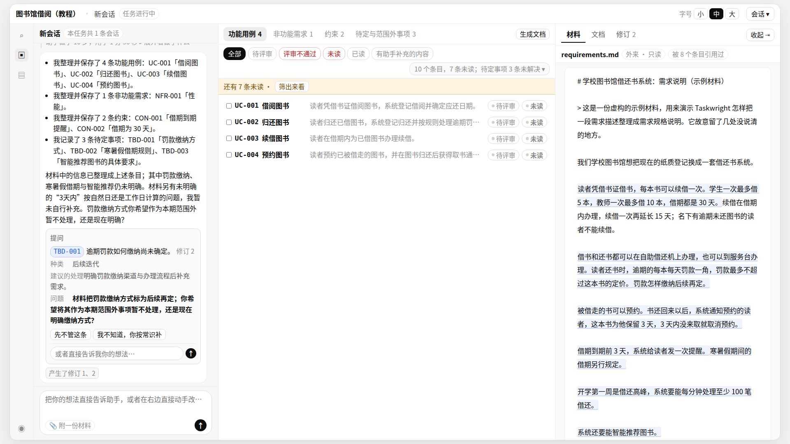

回复先列出它整理了什么：4 个功能用例、1 个非功能需求、2 条约束，以及 3 个问题条目。材料里有三处没说清（罚款怎么缴、寒暑假借期多长、「智能推荐」指什么），助手没有替你编答案，而是记成了问题条目 TBD-001 到 TBD-003，并用一张**提问**卡片先问罚款怎么缴。回复底部的小标签「产生了修订 1、2」说明这次工作把交付物保存了两次，第 19 步会点这样的标签。

每个功能用例都标着「待评审」和**未读**，编号和标题是加粗的，像一封没读过的邮件；条目区顶上写着「还有 7 条未读 · 筛出来看」。助手没有请你一条条确认：你打开看过一个条目，就算确认了它。问题条目不算在未读里，它们靠状态字段收口。先别急着回答问题，你想先看看它写得对不对。

## 第二幕：看一看，改一改

### 第 6 步：看一个条目从哪里来

你最先想知道的是：这些话是它编的，还是材料里有？在条目区点「借阅图书」（UC-001）。条目展开，列出每个字段，底部「来源」一节是支持它的来源小标签：

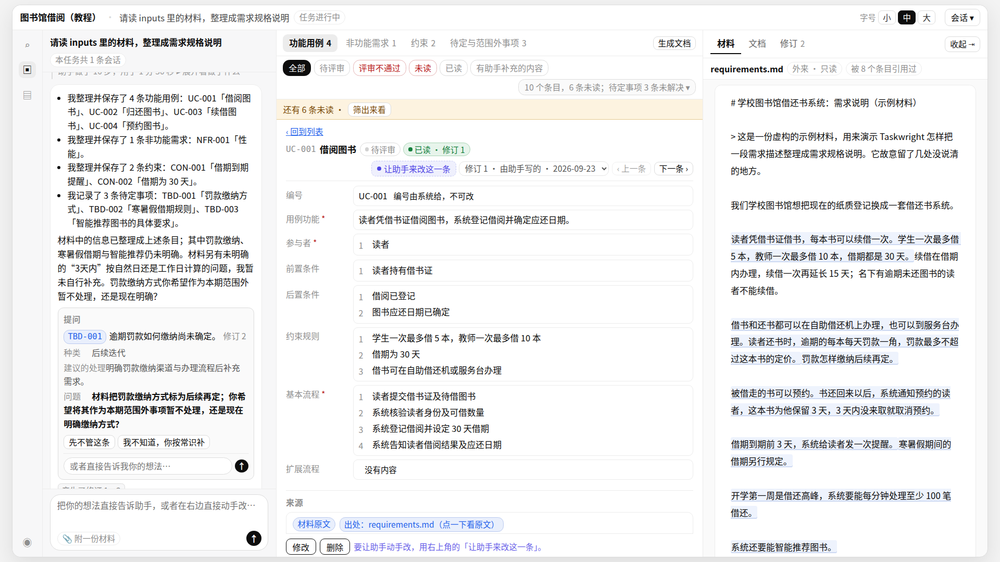

点「❝ requirements.md」这样的标签，右侧栏切到材料，滚到并高亮那句原文。材料里没有、由助手补上的部分标成「助手补充」并写明理由，顶部还有一条琥珀色的提醒；筛选按钮「有助手补充的内容」能把这类条目都筛出来。

注意标题行：UC-001 的状态从「未读」变成了**已读 · 修订 1**，条目区顶上变成「还有 6 条未读」。打开详情就记为已读，已读就算确认；详情右下角只显示状态，已读不能撤回。只认「打开详情」这一个动作：在列表里扫一眼不算，也不计你看了多久。

### 第 7 步：自己改一个字段

你想让这个用例写明在哪里借书。点底部的**修改**，字段变成可编辑。

只打开编辑、什么都不改的时候，对话区一切照常。一旦改动了文字还没保存，对话区的发送键和卡片上的按钮就全部变灰，输入框上方提示「先保存或取消正在编辑的条目」：

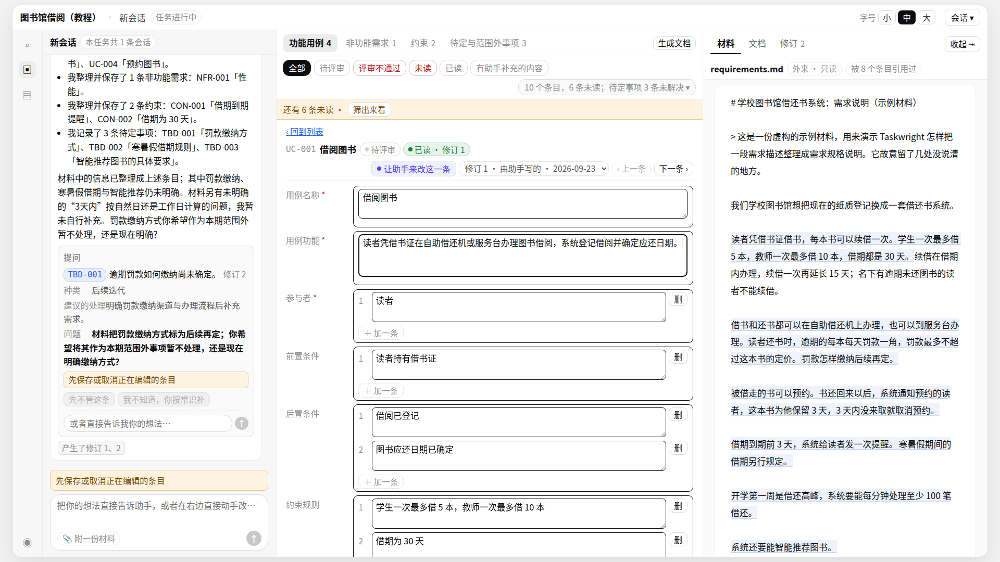

这是为了不让两边同时改交付物：你手里的编辑还没落定，就不去启动助手。我们把「用例功能」改成「读者凭借书证在自助借还机或服务台办理图书借阅，系统登记借阅并确定应还日期。」，点**保存**：

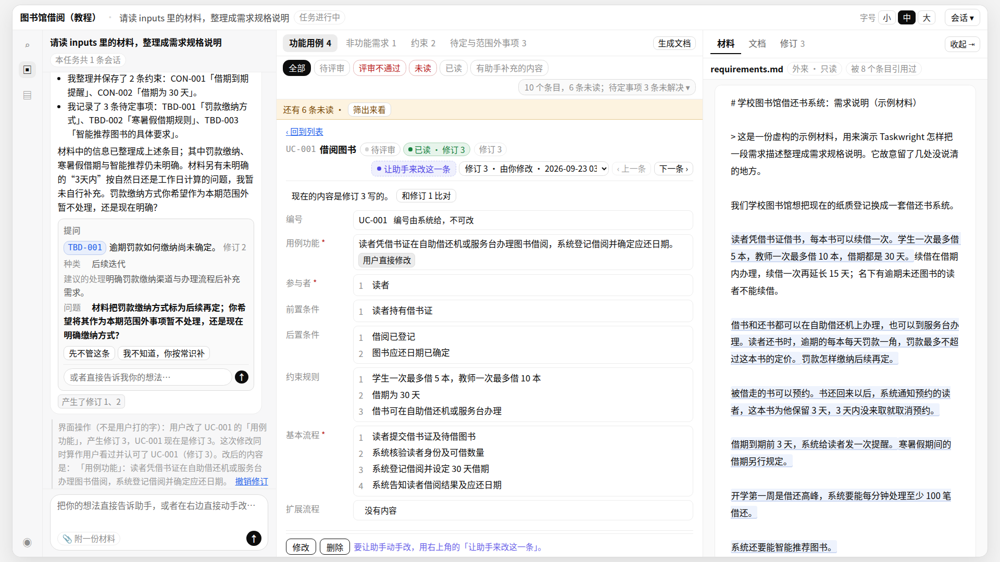

对话区恢复可用。你的保存产生了**修订 3**：修订号在整个任务里从 1 起连续编，助手的保存和你的操作共用一套编号。对话区多了一条灰色说明，开头是「界面操作（不是用户打的字）」，写明你改了哪个字段、产生了修订 3，并说这次修改同时算作你看过并认可了 UC-001（修订 3），后面带一个**撤销修订 3** 的链接；这句话也会让助手知道你改了什么。改过的字段带上了「用户直接修改」的来源标签。你亲手改出来的内容就是你认可的内容，所以状态直接是**已读 · 修订 3**。

### 第 8 步：请助手改一个条目，看它工作时界面怎样

你打开「归还图书」（UC-002），觉得「用例功能」太笼统，想让助手改。打开它的同时，它已经记为已读（修订 1）。点详情右上角的**让助手来改这一条**，输入框里预填了「请修改 UC-002：」，接着写你的要求：

> 请修改 UC-002：把「用例功能」写得更具体，写明读者可以在自助借还机或服务台归还，归还后系统计算并提示逾期罚款。

发出去以后，在它工作期间看一看界面：


- 条目区顶部是横幅「助手正在工作，结束后你可以继续修改」；**修改**、**删除**、先不管、撤销修订这些按钮全部是浅灰的，点了没有反应，详情底部写着同一句原因，鼠标停在按钮上也会说明。
- **让助手来改这一条**和问题条目上的**回答这个问题**没有变灰：它们只往输入框里预填文字，不改交付物。
- 发送键是灰的，但输入框能打字。我们趁这时写下了罚款问题的答案「罚款在服务台缴纳，可以用现金或校园卡。」，它会一直留在输入框里（刷新页面会把它清掉）。
- 这时打开别的条目照样会记为已读：记已读不改交付物，是「一次只有一方在改」的唯一例外。

右侧栏的**修订**页签在它工作时照常能看，只是卡片上的**撤销这次修订**是灰的：

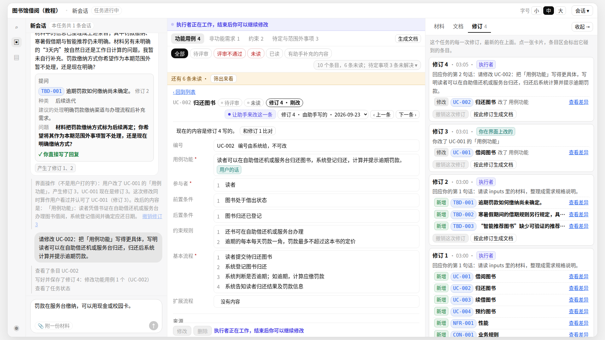

### 第 9 步：看它改了什么

工作结束，横幅消失，发送键恢复。助手的回复只告诉你它改了什么，没有请你确认。回到列表：

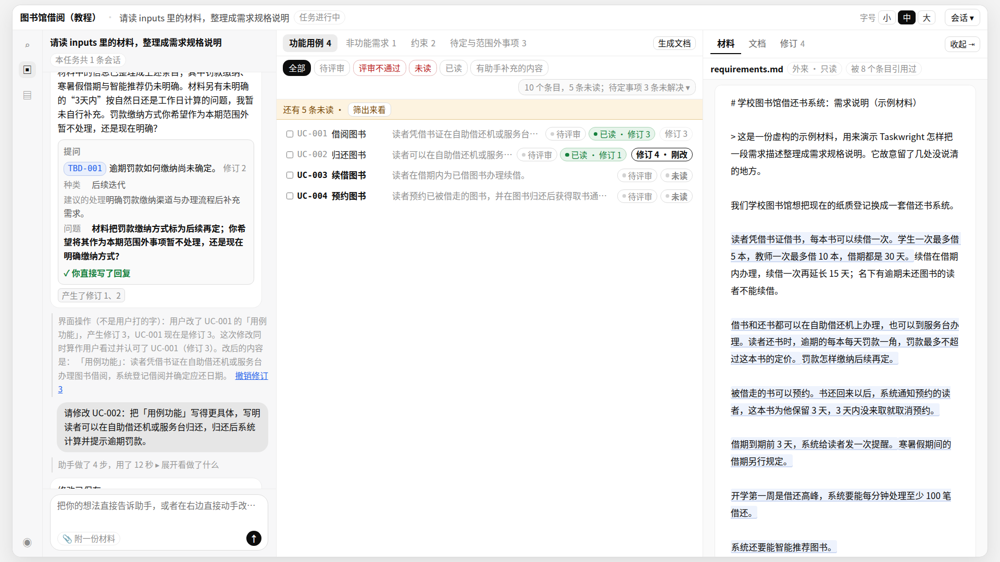

UC-002 标着「**修订 4 · 刚改**」，状态仍是**已读 · 修订 1**：你看过的是修订 1，现在是修订 4。已读是按条目算的，看过一次就一直是已读，不会因为助手改过又变回未读；「刚改」提醒你它之后又被改过，要不要再看由你决定。「刚改」只标助手最近一次工作改过的条目。打开 UC-002：

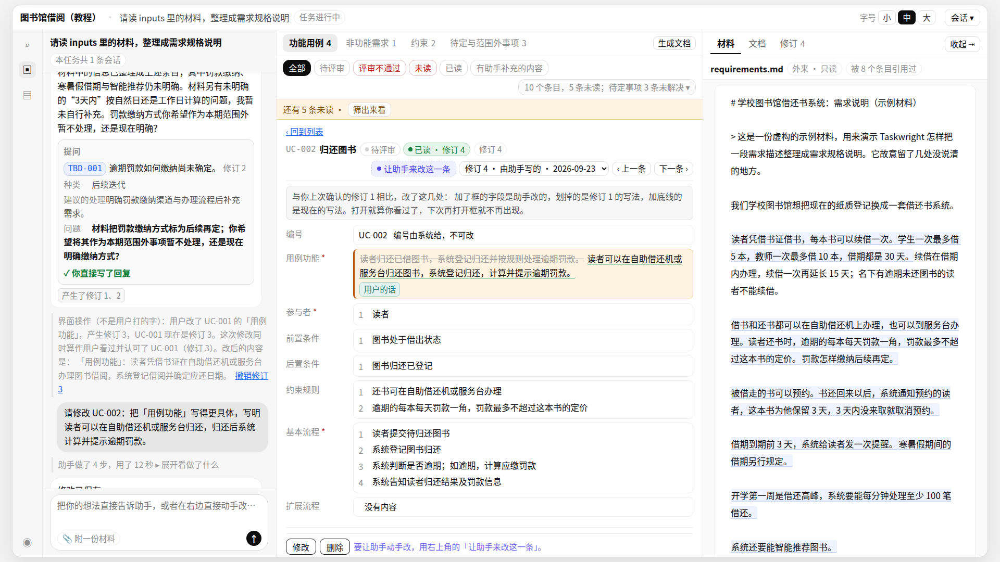

- 被改的「用例功能」整块加了琥珀色的左边线和浅底。顶部说明写着「与你上次确认的修订 1 相比，改了这几处」：划掉的是修订 1 的写法，加底线的是现在的写法。边框标的是**自你上次看过以来**助手改过的字段。
- 打开的同时它就记为已读（**已读 · 修订 4**），但这次打开期间框一直在；顶部说明也写着「打开就算你看过了，下次再打开框就不再出现」。
- 回复底部的小标签「产生了修订 4」指向这次工作保存的修订。改了什么也可以在右侧栏的修订页签里看（第 14 步）。

### 第 10 步：再请它改一处

你发现 UC-002 没写后置条件，又请它补上：

> 请修改 UC-002：补上后置条件——图书状态恢复为可借，读者的借阅记录注明归还日期。

这一次结束后打开 UC-002，只有「后置条件」带边框，说明写着「与你上次确认的修订 4 相比」：修订 4 你已经在第 9 步看过了，那次的改动不再框出来。边框的起点总是你上次看过的那次修订：

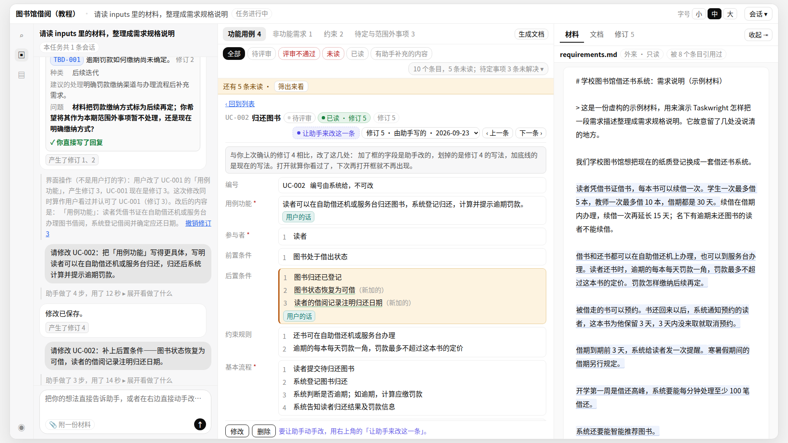

如果你中间没有打开它，助手几次的改动会一起框出来，起点是你最后看过的那一次。

### 第 11 步：自己再补一条

你想给 UC-002 加一条前置条件。点**修改**，在「前置条件」里点**＋ 加一条**，写「读者持有已借出的图书」，保存，产生修订 6：


你自己改的字段不带边框；保存又算作你看过了修订 6，所以整个条目都没有框，状态是**已读 · 修订 6**。

### 第 12 步：看过之后，框就不再出现

回到列表，再打开 UC-002：条目干干净净，没有任何边框，状态仍是已读：

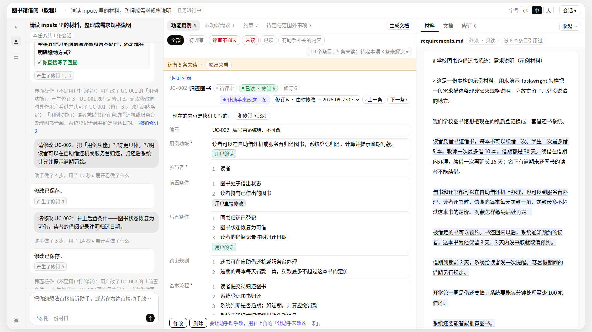

详情底部的「确认记录」一节列出这个条目的每一条确认标记，写明依据是「你打开看过（已读）」还是「你在界面上改了它」。

### 第 13 步：删掉一条多余的约束

你觉得约束「借阅到期提醒」（CON-001）不需要单列。切到**约束**页签打开它，点**删除**，会弹出一个小提示请你确认，并告诉你删除会产生一次修订、之后可以在修订页签撤销：

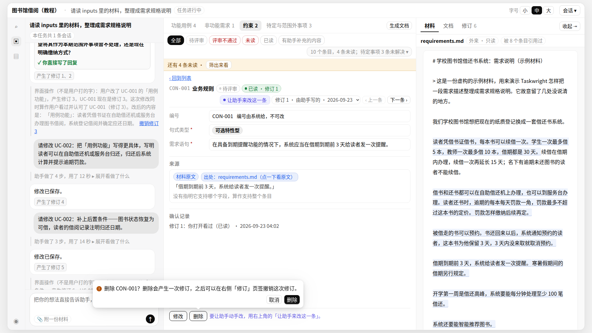

点提示里的**删除**。CON-001 从列表里消失，产生修订 7，对话区的说明末尾带着**撤销修订 7**：

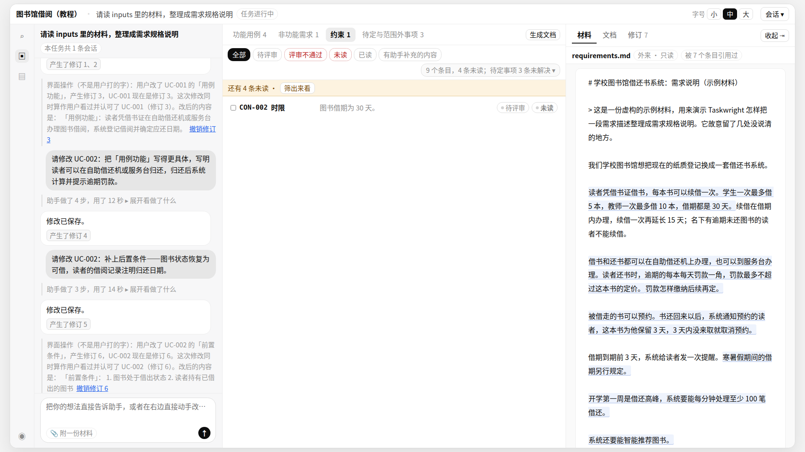

### 第 14 步：在修订页签里看来龙去脉

你想回头看看到目前为止交付物是怎样一步步变成现在这样的。打开右侧栏的**修订**页签：每次修订一张卡片，最新的在上面。卡片标题是「修订 N · 时刻 · 助手」或「修订 N · 时刻 · 你在界面上改的」；副标题写触发它的事，例如「回应你的第 2 句话：……」或「你删除了 CON-001」；正文每行一个条目，写着新增、修改、删除或恢复，以及改了哪些字段。

点修订 4 那张卡片，条目区高亮这次修订碰到的条目，集合页签上出现计数小圆，筛选行出现「修订 4 碰到的条目 ✕」，点 ✕ 取消高亮：

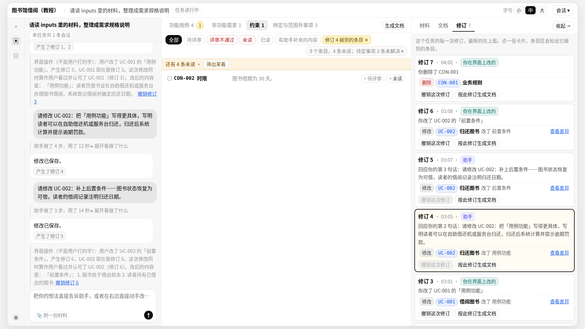

点卡片里那一行的**查看差异**，条目区打开 UC-002，停在它修订 4 时的样子，画线的地方是和它上一次改动（修订 1）的差别；顶部的**回到最新**回到现在的内容。从这里打开也是打开详情，UC-002 本来就是已读，不需要再记：

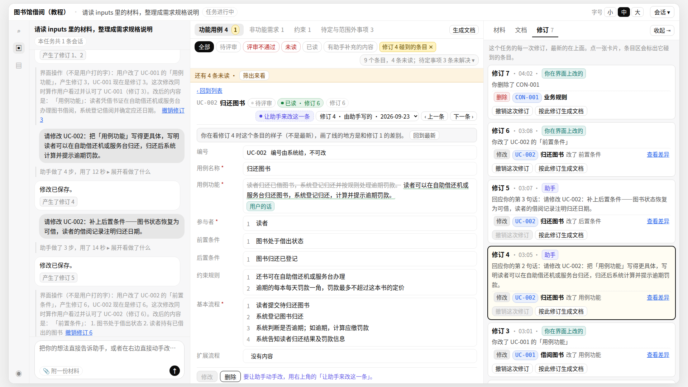

### 第 15 步：撤销那次删除

想了想，到期提醒还是留着吧。在修订 7 的卡片上点**撤销这次修订**（对话区那条说明里的**撤销修订 7** 作用一样），立即执行，不再弹出提示：

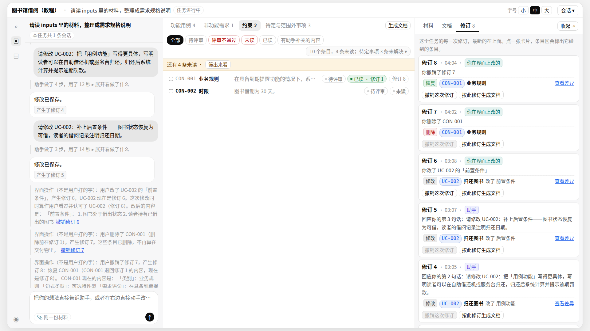

CON-001 回到约束列表。撤销不会抹掉那次删除，而是再加一次修订（修订 8）把条目放回去；修订页签最上面多了一张「你撤销了修订 7」。只要那次修订碰到的条目之后没有再被改过，就能撤销；撤销不了的修订，卡片上的**撤销这次修订**预先是灰的，鼠标停在上面会说明「这次修订碰到的条目之后又改过，不能撤销；要改请直接改条目」。

### 第 16 步：把读过的几条一起标为已读

UC-003 和 UC-004 很短，你在列表的摘要里已经读完了。勾选这两条，点出现的**把选中的这几条标为已读**：

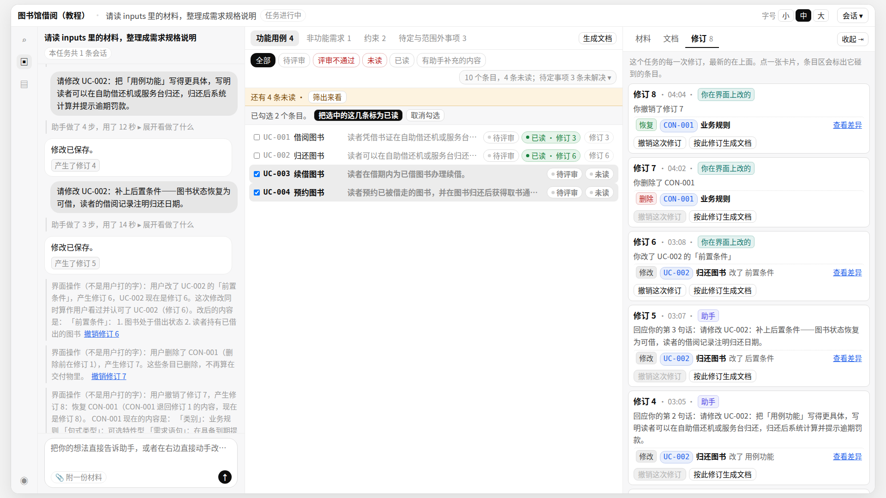

两条都变成「已读 · 修订 1」。这和打开详情效果相同，只是一次标几条。条目区顶上剩下「还有 2 条未读」。

## 第三幕：回答它的问题

### 第 17 步：打字回答

还记得第 5 步那张问罚款怎么缴的提问卡片吗？不必点卡片上的按钮，直接在输入框里写答案发出去就行：

> 罚款在服务台缴纳，可以用现金或校园卡。

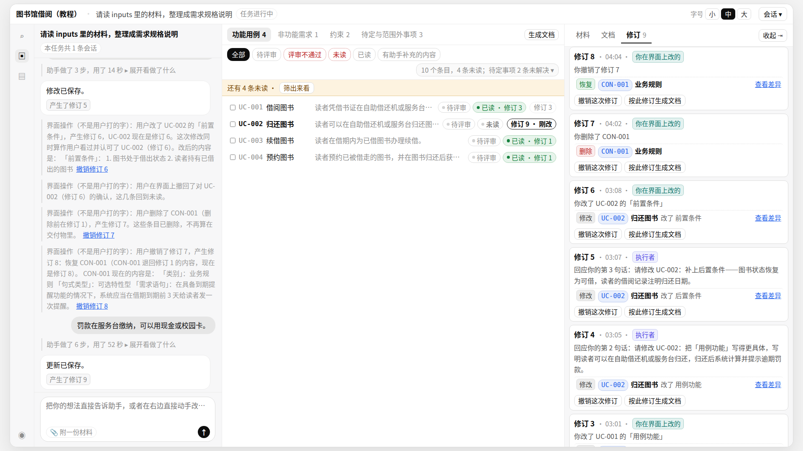

助手把答案写进了 UC-002 的约束规则与办理步骤，来源是「用户的话」，逐字引用你这句话；再把 TBD-001 标为已解决、写下处理结果，一共保存为修订 9。卡片收起，写着「你直接写了回复」。它只告诉你改了哪两条，没有请你确认；UC-002 在列表里标着「刚改」。

### 第 18 步：问还有什么要答

> 还有哪些问题要我回答？

它列出还剩两件：寒暑假借期的规则，以及「智能推荐」的具体要求。你让它一件一件来：

> 先问寒暑假借期那一条吧。

它用一张挂在 TBD-002 上的**提问**卡片问你：

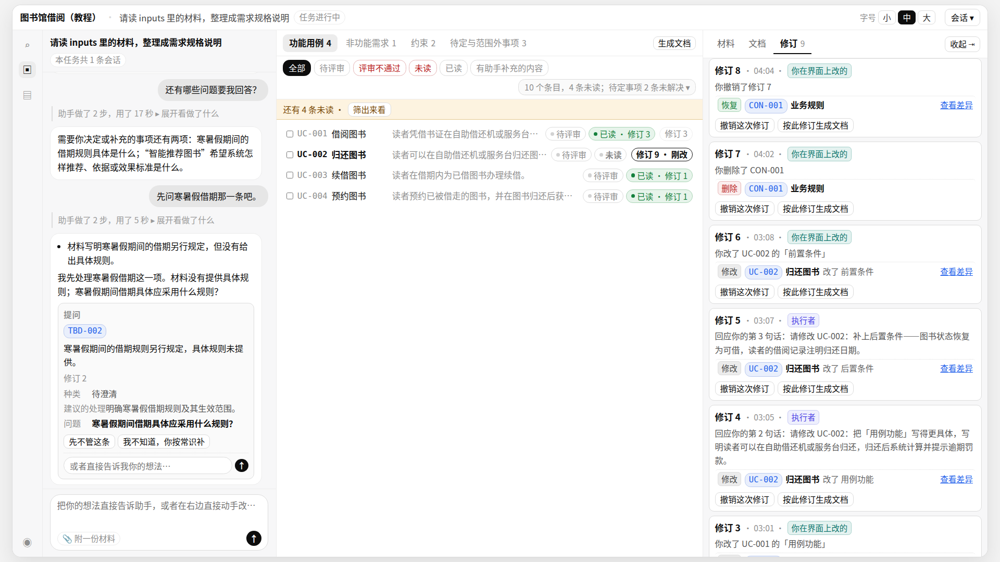

挂在问题条目上的提问卡片有两个按钮：**先不管这条**（第 21 步）和**我不知道，你按常识补**。

### 第 19 步：让它按常识补

你也不知道学校的寒暑假规定，点**我不知道，你按常识补**。卡片按固定的句子替你回答，助手按常见做法补上，并如实标为「助手补充」：

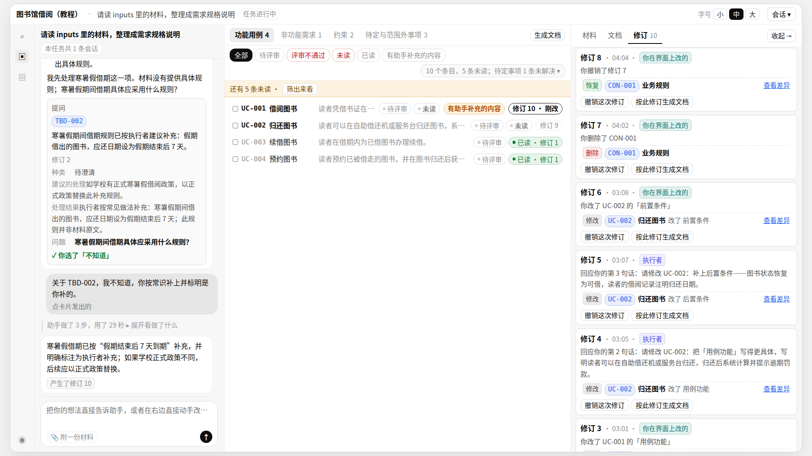

它在 UC-001 的约束规则里加了「寒暑假借出的图书，应还日期为假期结束后 7 天」，把 TBD-002 标为已解决，并说明这是它按常见做法补的、不是材料原文，产生修订 10。点回复底部的「产生了修订 10」，右侧栏切到修订页签并滚到这次修订：

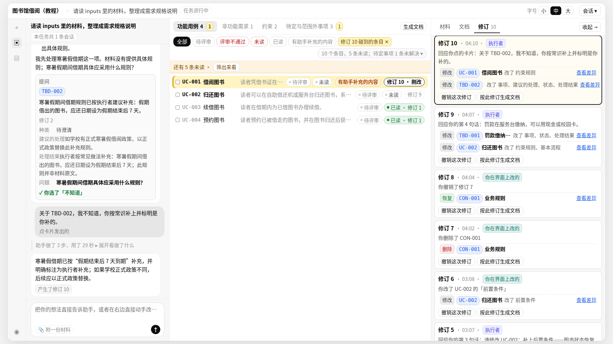

回到列表，UC-001 标着「刚改」。打开它：边框框出「约束规则」，说明写「与你上次确认的修订 3 相比」，也就是你在第 7 步亲手改出来的那次；顶部还有一条琥珀色的「助手补充」提醒：

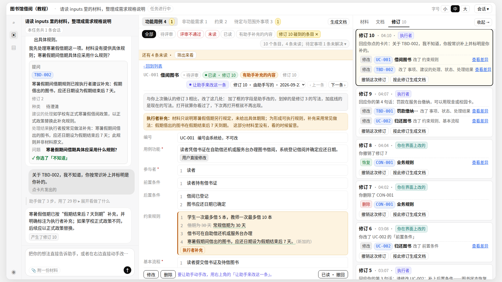

需要你明确表态时，助手也可以发一张**请确认**卡片，按钮是**这几条都看过了**和**不对**；点**这几条都看过了**就把卡片上的几条记为已读，同时告诉助手接着往下做。这一遍它没有用。

### 第 20 步：从几个做法里选

你还没想好「智能推荐」要推荐什么，请它给几个做法：

> 智能推荐这一条我还没想清楚，你给几个做法让我选。

它用一张**请选择**卡片列出三种做法：

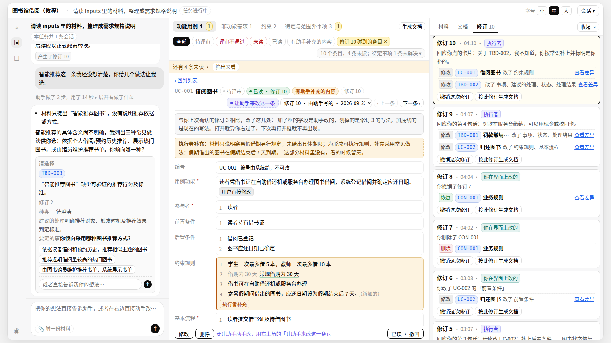

点「推荐近期借阅量较高的热门图书」。卡片收起，写着你选了哪一项。助手新增了功能用例 UC-005「查看热门图书推荐」（修订 11），把 TBD-003 标为已解决并关联 UC-005（修订 12）：

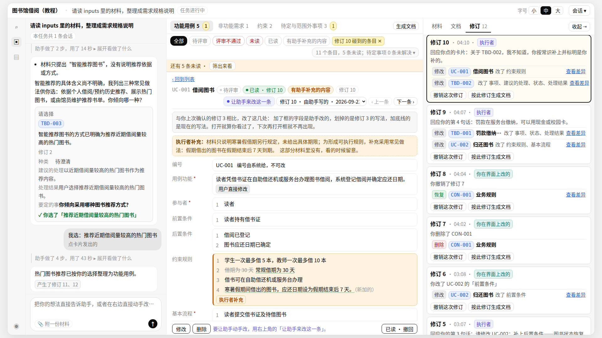

### 第 21 步：这条先不管

「近期」到底按多久算，你这一期还不打算定：

> 热门图书按多长时间内的借阅量来算，我还没定，你先记成一个问题再问我。

它新增了问题条目 TBD-004 并提问：

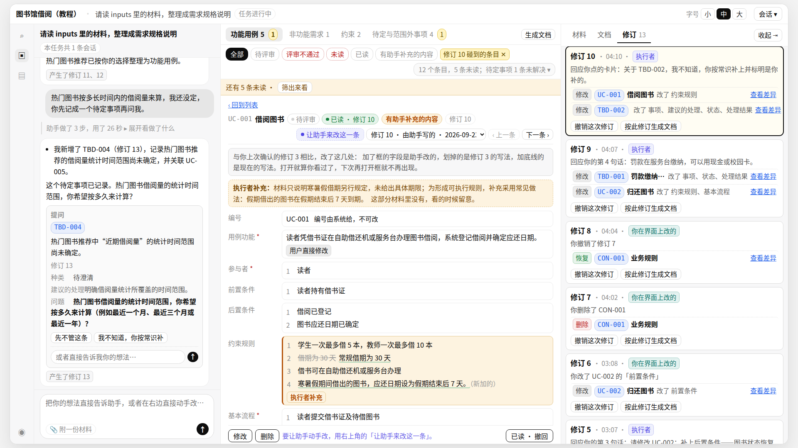

点卡片上的**先不管这条**。TBD-004 的状态改为「用户决定保留」，产生修订 14；这是你在界面上的直接操作，也同时算作你看过了它。助手随后告诉你：没有其他未解决的问题了，还请你打开上面 5 条未读的条目看一看：

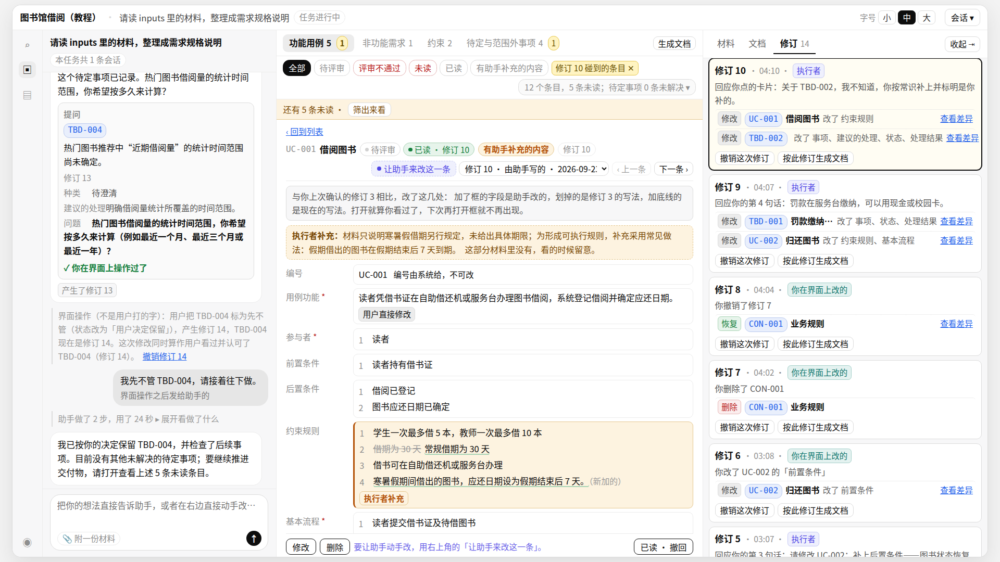

列表里问题条目卡片上的**先不管，保留**作用一样。

## 第四幕：看过就算确认

### 第 22 步：看完即确认

你想把未读的条目看一遍。点条目区顶上的**筛出来看**（或者筛选行的**未读**），列表只剩没看过的：

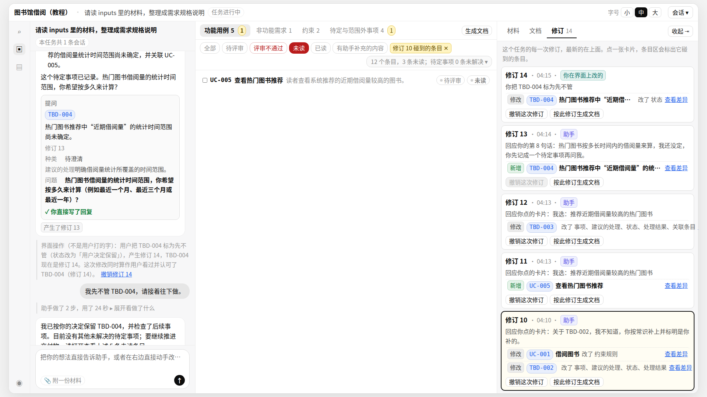

打开 UC-005。状态变成**已读 · 修订 11**，详情底部的「确认记录」写着「修订 11：你打开看过（已读）」：

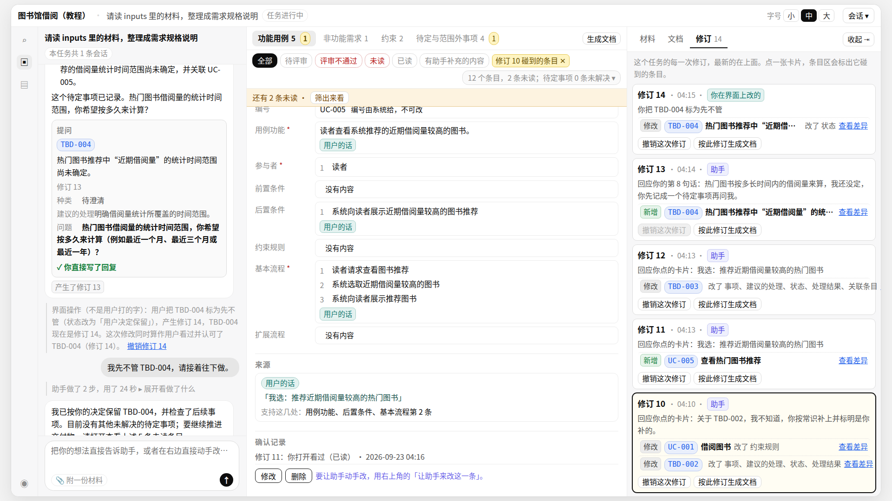

这就是确认：没有「确认」按钮要点，也不用在对话里说「可以」。已读是按条目算的：你看过 UC-005 之后，它再被改动也不会回到未读，助手改过的地方会用「刚改」和字段边框标出来。

### 第 23 步：说「可以」不算确认

在对话里说「可以」不会被当作确认。你试着说一句：

> UC-002 没问题。

助手回答：UC-002（修订 9）仍是未读，请你在界面上打开它看当前内容，才会记为已确认：

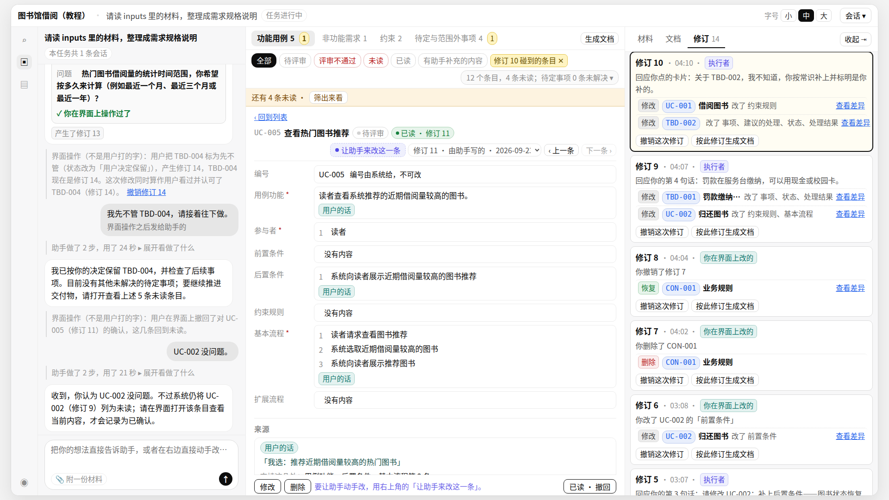

## 第五幕：看还差什么，然后完成

### 第 24 步：问一个条目的情况

> UC-004 预约图书现在是怎么写的？

它查了这个条目当前所在的修订，照实转述：

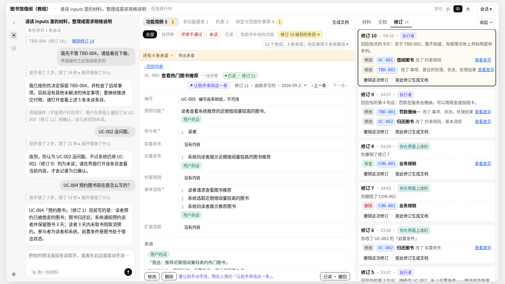

### 第 25 步：问还差什么

> 还差什么才能完成？

它查了任务状态，告诉你还差 4 条未读：UC-002「归还图书」、NFR-001「性能」、CON-001「业务规则」、CON-002「时限」；问题条目已经没有未解决的，功能用例的数量也够了，评审一条由开发期开关视为满足。点条目区汇总行末尾的 ▾，可以看到完成条件逐条的核对：

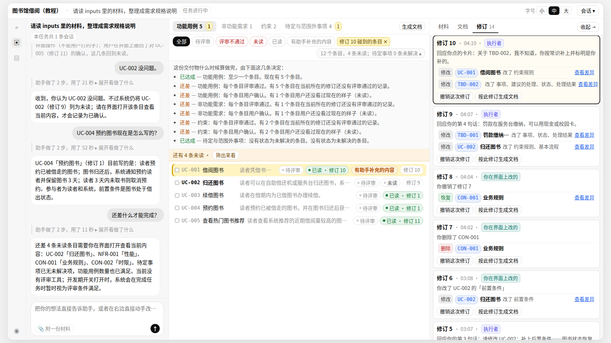

### 第 26 步：完成任务

你打开了 UC-002、NFR-001 和 CON-001，故意留下 CON-002 没看，然后问：

> 都看得差不多了，可以完成了吗？

它说还有 1 条未读（CON-002「时限」），请你先看。完成之前只剩未读挡着时，还没结掉的卡片下面会提示**还有 1 条未读**，旁边的**筛出来看**把条目区筛成未读的那一条：

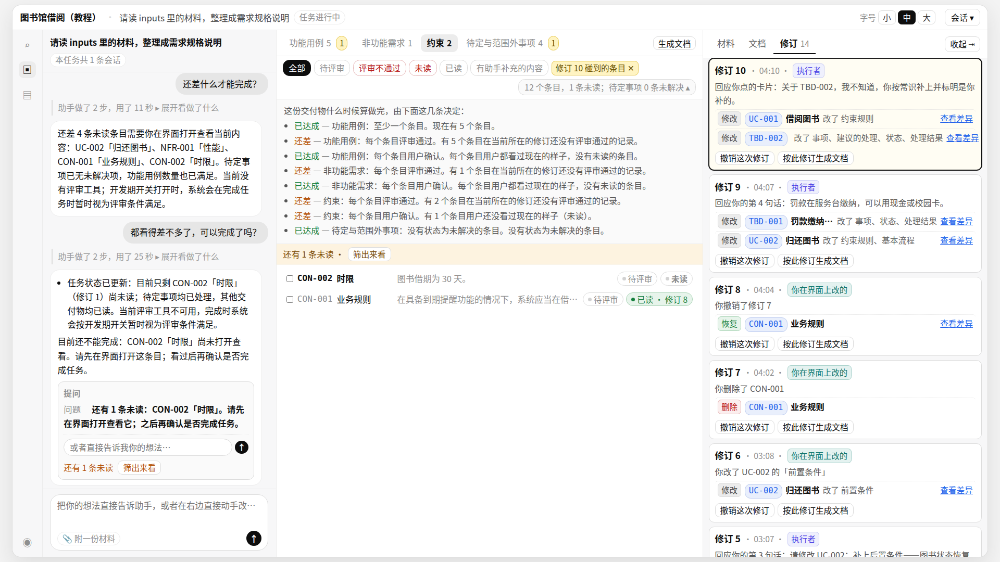

点**筛出来看**，打开 CON-002，未读清零。然后：

> 看完了，完成吧。

你已经明说要完成，它直接调用了完成任务，回复说任务已完成，并如实说明评审一条是开发期开关视为满足的，不是真的评审通过。（没有明说时，它会先用一张请选择卡片问你是否现在完成。）任务状态变成「已完成」，输入框收起：

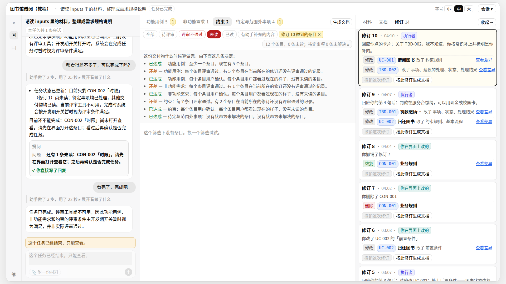

完成之后条目只读，打开详情，修改、删除都是灰的，鼠标停在上面会说明任务已结束：

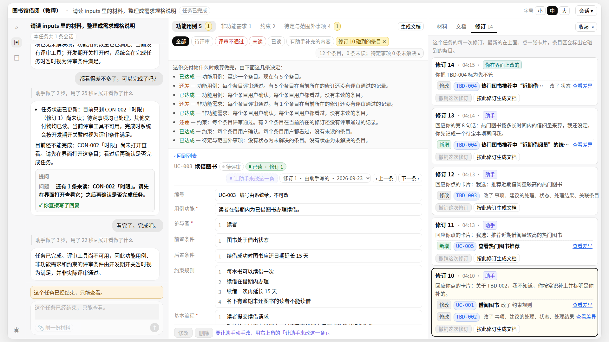

如果还有未读就直接请它完成，完成任务的工具会拒绝，并写明「还有 N 条你从没看过：……」，助手把这句话转告你。

## 第六幕：拿走文档，回头看它做了什么

### 第 27 步：按最新修订生成文档

你要把规格说明交出去。打开右侧栏的**文档**页签，点**生成文档**（条目区顶上的**生成文档**作用一样）：

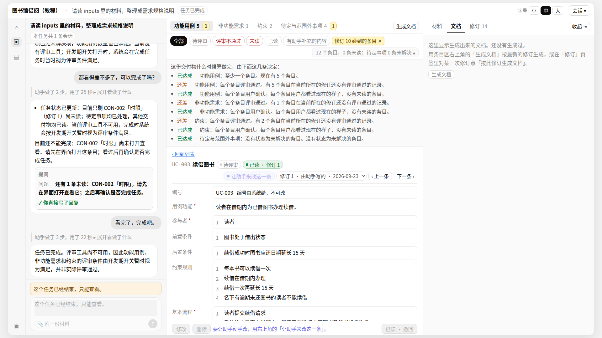

对话框默认选的是最新的修订（这里是修订 14），勾着那次修订时交付物里的全部条目，右边是预览：

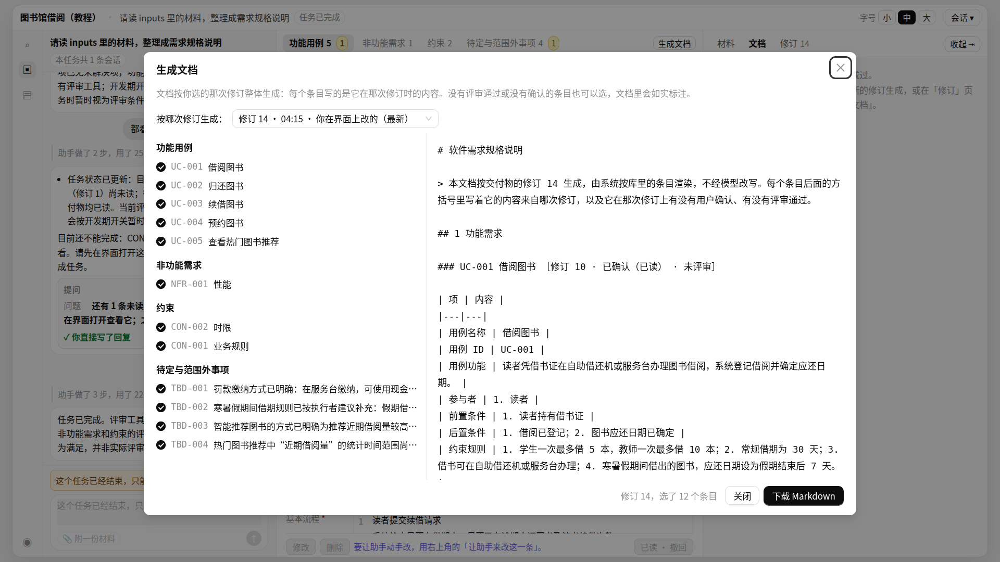

文档开头写着「本文档按交付物的修订 14 生成」。每个条目标题后面的方括号写着它的内容来自哪次修订、在那次修订上有没有确认与评审，确认还写明依据，例如 UC-001「［修订 10 · 已确认（已读） · 未评审］」。依据有三种写法：已读、用户修改，以及早期版本留下的明确确认。没确认的条目照样写进去，标「未确认」。来源的出处写成读者看得懂的话：「用户的话」写成「会话「……」里用户的第 N 句话」，「用户直接修改」写成「用户在界面上的第 N 次修改（时间）」，不印内部编号。文档不经过任何模型，是按任务目录里的模板 `docs/templates/srs.md` 渲染的。

### 第 28 步：只要其中两条

你只想先把借书和还书两个用例发给同事。去掉其他条目的勾，只留 UC-001 和 UC-002，预览里只有这两个条目：

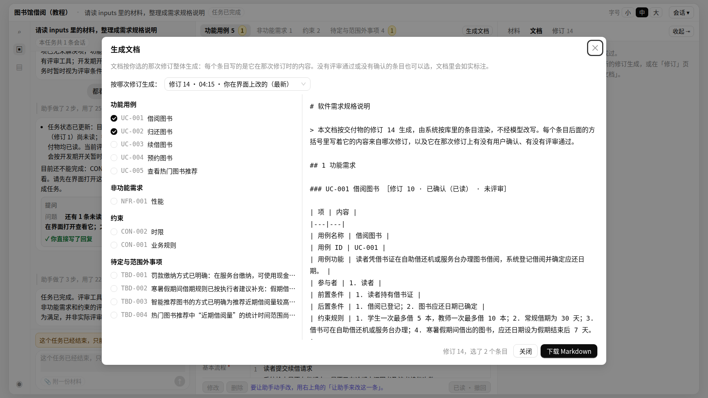

点**下载 Markdown**，下载的文件与预览逐字相同。任务完成之后照样可以生成和下载。

### 第 29 步：拿一份早先的版本

你想看看第 7 步你改完 UC-001 时交付物的样子。关掉对话框，打开**修订**页签，在修订 3 的卡片上点**按此修订生成文档**：

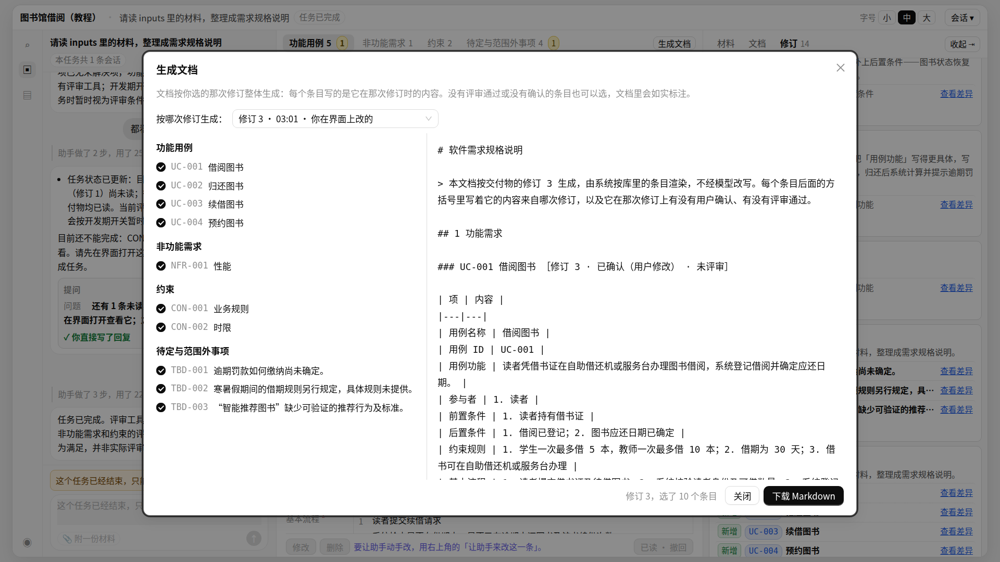

文档开头写着「按交付物的修订 3 生成」，内容是当时的样子。UC-001 标着「［修订 3 · 已确认（用户修改） · 未评审］」：它在修订 3 上的确认来自你亲手的修改；UC-002 到 UC-004 标着「已确认（已读）」，因为你看过的正是它们的修订 1；之后才新增的 UC-005 不在里面。

### 第 30 步：打开观测台

你想知道助手这一路到底做了什么。另开一个终端，在代码仓根目录激活虚拟环境，用这个任务的归档目录启动观测台。任务编号在浏览器地址栏的 `#/tasks/` 后面，例如 `TASK-20260923-D63F`：

```bash
python3 -m taskwright_observatory --runs ./runs/<任务编号> --workspaces ./tasks
```

打开 `http://127.0.0.1:8770`。「会话列表」一页每条会话一行，写着起止时间、运行次数、轮数、工具调用次数、被拒次数与结局：

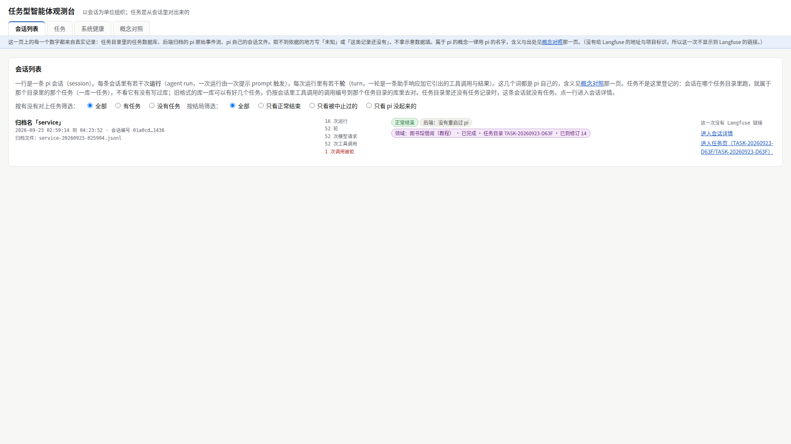

点「进入任务页」。页头汇总了整个任务（这一遍 16 次运行、52 次工具调用，其中 1 次被工具拒绝），下面按阶段列出任务的过程，你在界面上的每次操作也各占一条；右边是交付物看板与完成条件的逐条核对，「每个条目用户确认」一条写着「每个条目用户都看过，没有未读的条目」：

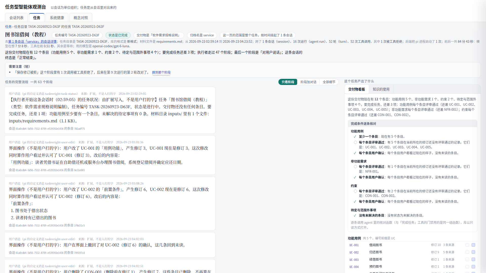

在交付物看板上点一个条目，弹出它改动过的每次修订，每次修订的字段、来源、评审与确认。观测台只读，不会改动任务。

### 第 31 步：七个工具

助手恰好有七个工具，「系统健康」一页核对了每次启动时实际发给模型的工具清单，与启动配置里的七个逐项相同：

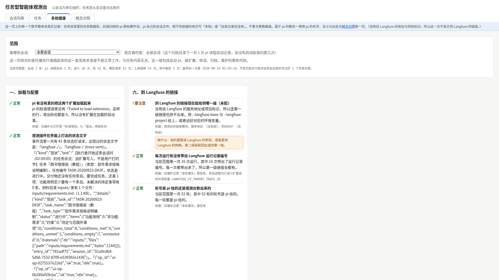

它不能执行命令，也不能改文件；它改交付物的唯一途径是保存修订。它也没有登记确认的工具：你看没看过条目，是界面在你打开详情时记下的。在任务页点**全部细节**，每次工具调用分三行：「调用」（带参数）、「结果」（标着「已接受」或「被拒绝」）和「变化」（交付物因此改了什么）。

- 列目录（`ls`）与读取（`read`）：第 4 步里，它先列出 `inputs/`，再读材料全文，之前还读了方法说明、任务定义和写作规矩。
- 保存修订（`save_revision`）：一次调用带一批操作，结果写明这是任务的第几次修订、每个条目「现在是修订 N」。
- 回复（`reply`）：带着告知、末位主行为与正文，结果是「回复已送达」，不改动任何东西。
- 查看条目（`get_item`）：第 24 步，结果是这个条目当时的字段、来源和改动过的修订。
- 查询任务状态（`get_task_status`）：第 25 步，结果列出各集合的条目、每条完成条件满足没有，以及未读清单。
- 完成任务（`complete_task`）：第 26 步，结果写明全部完成条件已满足，以及哪几条只是靠开发期开关才算满足。

**被拒绝时是什么样子。** 这一遍里有一次保存修订被拒。观测台在任务页顶上的「需要注意」里点出它，把这次调用标成红色的「被拒绝」，照录工具的原话，并链接到它改对的那一轮。每个工具拒绝的方式都一样：准确说明哪里不对；写入类工具一个字也不写；助手可以改正之后再试。

### 第 32 步：调一调字号

回到工作视图。文字随窗口宽度自动缩放；嫌小可以在顶栏点「字号」的**大**，嫌挤就点**小**。选择记在浏览器里，刷新后仍然有效：

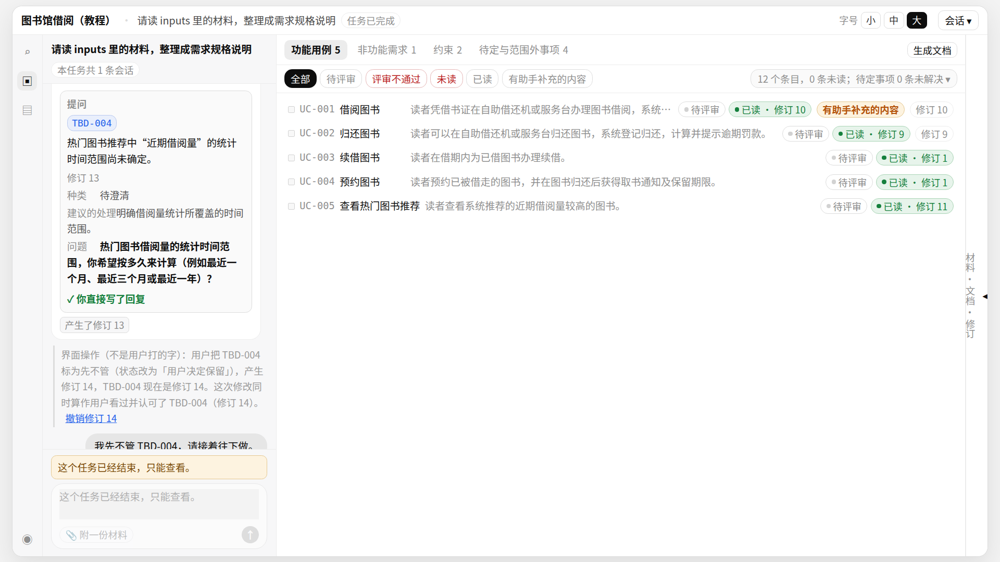

## 你用到了什么

五种直接操作（网页界面上）：

| 操作 | 在哪一步 |
|---|---|
| 修改字段 | 第 7、11 步 |
| 删除条目 | 第 13 步 |
| 标为已读（打开详情，或勾选几条） | 第 6、8、9、12、16、22、26 步 |
| 撤销一次修订 | 第 15 步 |
| 把问题条目标为先不管 | 第 21 步 |

七个工具：

| 工具 | 做什么 | 在哪一步 |
|---|---|---|
| 读取（`read`） | 读一个文件：材料、任务定义、写作规矩。 | 第 4 步 |
| 列目录（`ls`） | 列一个目录，例如 `inputs/`。 | 第 4 步 |
| 保存修订（`save_revision`） | 把一批条目操作存成一次修订；修改与删除要写条目当前所在的修订号，有一项不对整批都不写。 | 第 4、8、10、17、19、20、21 步 |
| 回复（`reply`） | 把要对你说的话发出来：告知、至多一个末位主行为、正文。 | 每一次回复 |
| 查看条目（`get_item`） | 看一个条目的字段、来源、所在的修订与状态。 | 第 24 步，以及它修改条目之前 |
| 查询任务状态（`get_task_status`） | 看各集合的条目、每条完成条件、问题条目与未读清单。 | 第 25、26 步 |
| 完成任务（`complete_task`） | 再核对一遍完成条件，然后把任务标为已完成；还有未读时拒绝并写明是哪几条。 | 第 26 步 |

## 接下来

- [用户手册](../user-guide.zh-CN.md)：各种卡片、其他操作方式（终端客户端、pi 自带的终端界面），以及观测台各页的完整说明。
- [功能说明](../capabilities.zh-CN.md)：当前版本能做什么、还不能做什么。
- `examples/library-lending/run.sh`：只用 HTTP 接口走同样的前半段流程（见[用户手册第 5 节](../user-guide.zh-CN.md#5-跑一遍示例)）。
